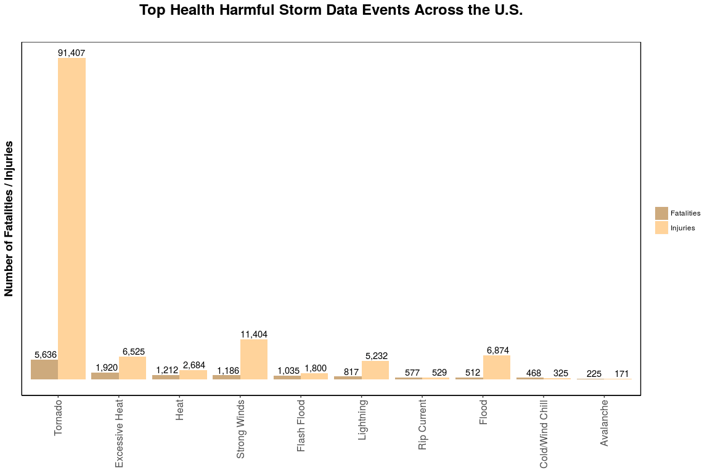
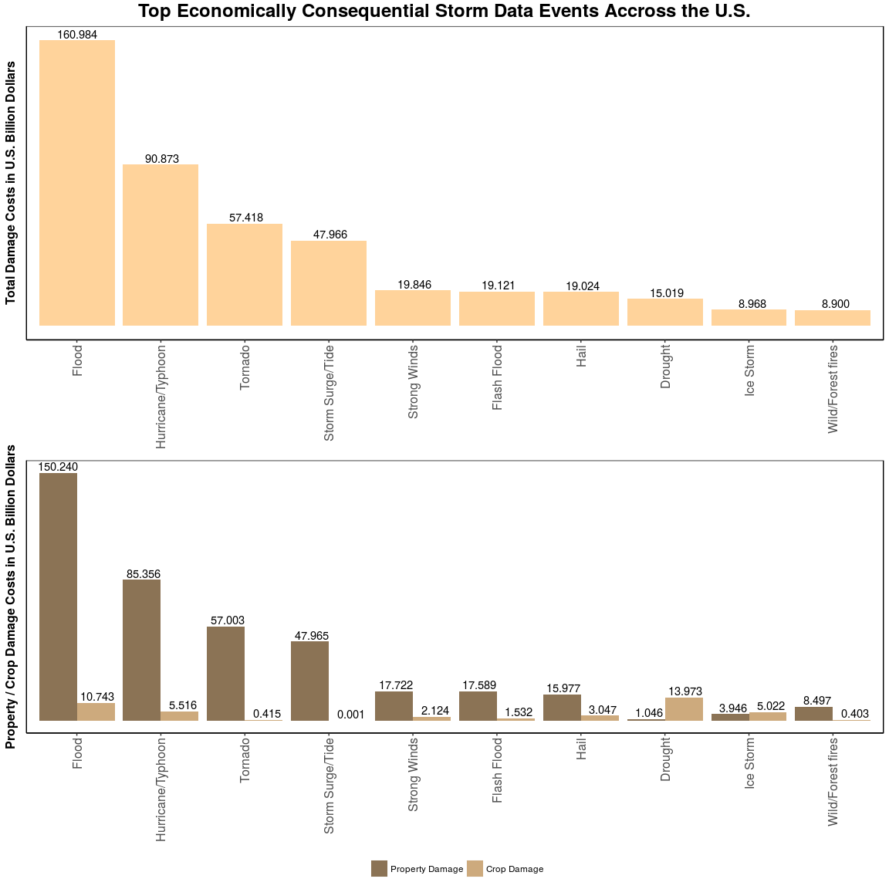

-   [Installing the Required Packages](#installing-the-required-packages)
-   [Importing the Required Packages](#importing-the-required-packages)
-   [Enabling Caching](#enabling-caching)
-   [Setting a Seed](#setting-a-seed)
-   [Synopsis](#synopsis)
-   [Data Processing](#data-processing)
    -   [Downloading the Raw Data](#downloading-the-raw-data)
    -   [Raw Data Variables Types](#raw-data-variables-types)
    -   [Raw Data Variables Description](#raw-data-variables-description)
    -   [Data Cleaning](#data-cleaning)
        -   [`PROPDMGEXP` and `CROPDMGEXP`](#propdmgexp-and-cropdmgexp)
        -   [`EVTYPE`](#evtype)
-   [Clean Data-set](#clean-data-set)
-   [Exploratory Data Analysis](#exploratory-data-analysis)
    -   [Which types of events are most harmful to population health?](#which-types-of-events-are-most-harmful-to-population-health)
    -   [Which types of events have the greatest economic consequences?](#which-types-of-events-have-the-greatest-economic-consequences)
-   [Results](#results)
    -   [Which types of events are most harmful to population health?](#which-types-of-events-are-most-harmful-to-population-health-1)
    -   [Which types of events have the greatest economic consequences?](#which-types-of-events-have-the-greatest-economic-consequences-1)

Installing the Required Packages
--------------------------------

You might need to install the following packages if you don't already have them:

``` r
install.packages("ktable")
install.packages("plyr")
install.packages("dplyr")
install.packages("ggplot2")
install.packages("gridExtra")
install.packages("lubridate")
install.packages("reshape2")
install.packages("data.table")
install.packages("R.utils")
```

Just run the commands for the packages you need or run the whole chunk before you run the remaining ones in this notebook.

Importing the Required Packages
-------------------------------

Once the libraries are installed, they need to be loaded as follows:

``` r
suppressMessages(library(plyr))       # Data frame manipulation
suppressMessages(library(dplyr))
suppressMessages(library(ggplot2))    # Plotting
suppressMessages(library(gridExtra))
suppressMessages(library(grid))
suppressMessages(library(lubridate))  # Date manipulation
suppressMessages(library(reshape2))   # Data frame manipulation
suppressMessages(library(data.table))
suppressMessages(library(R.utils))    # File compression utils
```

Enabling Caching
----------------

The raw data-set is pretty big, which might make rendering the output slow, so let's enable knitr's global caching:

Setting a Seed
--------------

Just so this notebooḱ's data-set samplings are reproducible:

``` r
set.seed(123)
```

Synopsis
--------

The [National Oceanic and Atmospheric Administration (NOAA)](https://www.ncdc.noaa.gov/) makes available a [database](https://www.ncdc.noaa.gov/stormevents/), in which this organization keeps track of the occurence of unusual weather phenomena that impact human life (i.e., cause signifcant loss of lives, injuries, property and crop damages, etc).

The purpose of this analysis is to identify the top weather phenomena ("Storm Data Events"") in terms of human health harm and economic impact.

The raw data-set provides individual records for each event with the associated figures for their impact and time of occurence among other information, thus our primary goal is to aggregate such data by type of event and extract relevant insights from such data aggregations in the form of tables and plots.

Data Processing
---------------

### Downloading the Raw Data

``` r
read_bz2_csv <- function(url) {
  temp_bz2_file <- tempfile()
  temp_csv_file <- tempfile()
  download.file(url, temp_bz2_file, quiet = TRUE)
  data <- as.data.frame(fread(bunzip2(temp_bz2_file, temp_csv_file), stringsAsFactors = FALSE, encoding = "Latin-1"))
  unlink(temp_bz2_file)
  unlink(temp_csv_file)
  data
}

storm_data <- read_bz2_csv("https://d396qusza40orc.cloudfront.net/repdata%2Fdata%2FStormData.csv.bz2")
```

    ## 
    Read 0.0% of 967216 rows
    Read 22.7% of 967216 rows
    Read 37.2% of 967216 rows
    Read 49.6% of 967216 rows
    Read 57.9% of 967216 rows
    Read 71.3% of 967216 rows
    Read 78.6% of 967216 rows
    Read 83.7% of 967216 rows
    Read 93.1% of 967216 rows
    Read 902297 rows and 37 (of 37) columns from 0.523 GB file in 00:00:11

``` r
sample_n(storm_data, 6)
```

|        |  STATE\_\_| BGN\_DATE         | BGN\_TIME   | TIME\_ZONE |  COUNTY| COUNTYNAME | STATE | EVTYPE     |  BGN\_RANGE| BGN\_AZI | BGN\_LOCATI      | END\_DATE         | END\_TIME   |  COUNTY\_END| COUNTYENDN |  END\_RANGE| END\_AZI | END\_LOCATI |  LENGTH|  WIDTH| F   |  MAG|  FATALITIES|  INJURIES|  PROPDMG| PROPDMGEXP |  CROPDMG| CROPDMGEXP | WFO | STATEOFFIC              | ZONENAMES   |  LATITUDE|  LONGITUDE|  LATITUDE\_E|  LONGITUDE\_| REMARKS                                                                                                                                                                                                                                                                                                                                                                                                                                                                                                                               |  REFNUM|
|--------|----------:|:------------------|:------------|:-----------|-------:|:-----------|:------|:-----------|-----------:|:---------|:-----------------|:------------------|:------------|------------:|:-----------|-----------:|:---------|:------------|-------:|------:|:----|----:|-----------:|---------:|--------:|:-----------|--------:|:-----------|:----|:------------------------|:------------|---------:|----------:|------------:|------------:|:--------------------------------------------------------------------------------------------------------------------------------------------------------------------------------------------------------------------------------------------------------------------------------------------------------------------------------------------------------------------------------------------------------------------------------------------------------------------------------------------------------------------------------------|-------:|
| 796744 |          1| 3/12/2010 0:00:00 | 02:30:00 AM | CST        |      59| FRANKLIN   | AL    | HAIL       |           1| W        | NIX              | 3/12/2010 0:00:00 | 02:35:00 AM |            0| NA         |           0|          |             |       0|      0|     |    1|           0|         0|        0| K          |        0| K          | HUN | ALABAMA, North          |             |      3421|       8747|            0|            0| EPISODE NARRATIVE: A strong storm system brought a potent cold front through the Mississippi Valley and across northern Alabama after midnight on Thursday. A line of strong to severe thunderstorms developed along and ahead of the front, producing numerous reports of large hail, particularly in northeastern Alabama. Some locations in DeKalb and Marshall counties had hail reported to be up to 8 inches deep and up 2 inches in diameter.EVENT NARRATIVE: Quarter size hail was reported five miles west of Phil Campbell. |  796744|
| 848580 |          6| 3/20/2011 0:00:00 | 12:00:00 AM | PST        |      73| CAZ073     | CA    | HEAVY SNOW |           0|          |                  | 3/21/2011 0:00:00 | 02:00:00 AM |            0| NA         |           0|          |             |       0|      0|     |    0|           0|         0|        0| K          |        0| K          | REV | CALIFORNIA, Northeast   | MONO - MONO |         0|          0|            0|            0| EPISODE NARRATIVE: A very cold low dropped slowly south from off the Washington coast on the 18th before moving into northern California on the 21st. This brought a couple rounds of heavy snow to the Sierra and northeast California.EVENT NARRATIVE: Twenty-two to 32 inches of snow fell on the 20th and into early on the 21st in the higher elevations and near Lee Vining (22 inches), with 12 to 18 inches elsewhere.                                                                                                        |  848560|
| 41106  |         19| 5/6/1971 0:00:00  | 0920        | CST        |     129| MILLS      | IA    | HAIL       |           0|          |                  |                   |             |            0| NA         |           0|          |             |       0|      0|     |  200|           0|         0|        0|            |        0|            |     |                         |             |      4105|       9547|            0|            0|                                                                                                                                                                                                                                                                                                                                                                                                                                                                                                                                       |   41106|
| 476507 |         47| 4/28/2002 0:00:00 | 08:40:00 AM | CST        |       7| BLEDSOE    | TN    | TSTM WIND  |           5| NW       | PIKEVILLE        | 4/28/2002 0:00:00 | 08:40:00 AM |            0| NA         |           5| NW       | PIKEVILLE   |       0|      0|     |    0|           0|         0|        5| K          |        0|            | MRX | TENNESSEE, East         |             |      3539|       8516|         3539|         8516| Trees reported down along Highway 30 in western part of county.                                                                                                                                                                                                                                                                                                                                                                                                                                                                       |  476436|
| 805224 |         46| 5/23/2010 0:00:00 | 11:40:00 PM | CST        |      15| BRULE      | SD    | HAIL       |           1| N        | CHAMBERLAIN ARPT | 5/23/2010 0:00:00 | 11:40:00 PM |            0| NA         |           0|          |             |       0|      0|     |    1|           0|         0|        0| K          |        0| K          | FSD | SOUTH DAKOTA, Southeast |             |      4348|       9919|            0|            0| EPISODE NARRATIVE: A thunderstorm produced quarter size hail at Chamberlain just before midnight on May 23rd.EVENT NARRATIVE:                                                                                                                                                                                                                                                                                                                                                                                                         |  805224|
| 497556 |         21| 3/20/2003 0:00:00 | 06:00:00 PM | EST        |      51| CLAY       | KY    | HAIL       |           0|          | BURNING SPGS     | 3/20/2003 0:00:00 | 06:00:00 PM |            0| NA         |           0|          | ONEIDA      |       0|      0|     |   88|           0|         0|        0| K          |        0| K          | JKL | KENTUCKY, Eastern       |             |      3715|       8348|         3716|         8338|                                                                                                                                                                                                                                                                                                                                                                                                                                                                                                                                       |  497506|

The input file's original encoding "Latin1" causes problems for some R string operations, thus we are going to convert the string variables we need to work with to "ASCII":

``` r
storm_data$PROPDMGEXP <- iconv(storm_data$PROPDMGEXP, from = "Latin1", to = "ASCII", sub = "")
storm_data$CROPDMGEXP <- iconv(storm_data$CROPDMGEXP, from = "Latin1", to = "ASCII", sub = "")
```

Let's see how many records we have:

``` r
dim(storm_data)
```

    ## [1] 902297     37

Our raw data-set have 902297 records and 37 variables.

### Raw Data Variables Types

Follows a full list of variables and their correspondent types:

``` r
str(storm_data)
```

    ## 'data.frame':    902297 obs. of  37 variables:
    ##  $ STATE__   : num  1 1 1 1 1 1 1 1 1 1 ...
    ##  $ BGN_DATE  : chr  "4/18/1950 0:00:00" "4/18/1950 0:00:00" "2/20/1951 0:00:00" "6/8/1951 0:00:00" ...
    ##  $ BGN_TIME  : chr  "0130" "0145" "1600" "0900" ...
    ##  $ TIME_ZONE : chr  "CST" "CST" "CST" "CST" ...
    ##  $ COUNTY    : num  97 3 57 89 43 77 9 123 125 57 ...
    ##  $ COUNTYNAME: chr  "MOBILE" "BALDWIN" "FAYETTE" "MADISON" ...
    ##  $ STATE     : chr  "AL" "AL" "AL" "AL" ...
    ##  $ EVTYPE    : chr  "TORNADO" "TORNADO" "TORNADO" "TORNADO" ...
    ##  $ BGN_RANGE : num  0 0 0 0 0 0 0 0 0 0 ...
    ##  $ BGN_AZI   : chr  "" "" "" "" ...
    ##  $ BGN_LOCATI: chr  "" "" "" "" ...
    ##  $ END_DATE  : chr  "" "" "" "" ...
    ##  $ END_TIME  : chr  "" "" "" "" ...
    ##  $ COUNTY_END: num  0 0 0 0 0 0 0 0 0 0 ...
    ##  $ COUNTYENDN: logi  NA NA NA NA NA NA ...
    ##  $ END_RANGE : num  0 0 0 0 0 0 0 0 0 0 ...
    ##  $ END_AZI   : chr  "" "" "" "" ...
    ##  $ END_LOCATI: chr  "" "" "" "" ...
    ##  $ LENGTH    : num  14 2 0.1 0 0 1.5 1.5 0 3.3 2.3 ...
    ##  $ WIDTH     : num  100 150 123 100 150 177 33 33 100 100 ...
    ##  $ F         : chr  "3" "2" "2" "2" ...
    ##  $ MAG       : num  0 0 0 0 0 0 0 0 0 0 ...
    ##  $ FATALITIES: num  0 0 0 0 0 0 0 0 1 0 ...
    ##  $ INJURIES  : num  15 0 2 2 2 6 1 0 14 0 ...
    ##  $ PROPDMG   : num  25 2.5 25 2.5 2.5 2.5 2.5 2.5 25 25 ...
    ##  $ PROPDMGEXP: chr  "K" "K" "K" "K" ...
    ##  $ CROPDMG   : num  0 0 0 0 0 0 0 0 0 0 ...
    ##  $ CROPDMGEXP: chr  "" "" "" "" ...
    ##  $ WFO       : chr  "" "" "" "" ...
    ##  $ STATEOFFIC: chr  "" "" "" "" ...
    ##  $ ZONENAMES : chr  "" "" "" "" ...
    ##  $ LATITUDE  : num  3040 3042 3340 3458 3412 ...
    ##  $ LONGITUDE : num  8812 8755 8742 8626 8642 ...
    ##  $ LATITUDE_E: num  3051 0 0 0 0 ...
    ##  $ LONGITUDE_: num  8806 0 0 0 0 ...
    ##  $ REMARKS   : chr  "" "" "" "" ...
    ##  $ REFNUM    : num  1 2 3 4 5 6 7 8 9 10 ...

### Raw Data Variables Description

You will find some documentation on this data-set in the following links:

-   [National Weather Service Storm Data Documentation](https://d396qusza40orc.cloudfront.net/repdata%2Fpeer2_doc%2Fpd01016005curr.pdf "National Weather Service Storm Data Documentation")
-   [National Climatic Data Center Storm Events FAQ](https://d396qusza40orc.cloudfront.net/repdata%2Fpeer2_doc%2FNCDC%20Storm%20Events-FAQ%20Page.pdf "National Climatic Data Center Storm Events FAQ")

Follow short descriptions of these variables based on information taken from these sources:

<table>
<colgroup>
<col width="7%" />
<col width="92%" />
</colgroup>
<thead>
<tr class="header">
<th>Variable</th>
<th>Description</th>
</tr>
</thead>
<tbody>
<tr class="odd">
<td>STATE__</td>
<td>Doesn't seem to be a state ID, given that the range is from 1 to 94.</td>
</tr>
<tr class="even">
<td>BGN_DATE</td>
<td>Date the event started to have an impact. A string with format &quot;%m/%d/%Y 0:00:00&quot;.</td>
</tr>
<tr class="odd">
<td>BGN_TIME</td>
<td>Time the event started to have an impact. A string with no particular format (probably data merged from different sources).</td>
</tr>
<tr class="even">
<td>TIME_ZONE</td>
<td>Time zone, e.g., &quot;EST&quot;, &quot;PST&quot;, etc.</td>
</tr>
<tr class="odd">
<td>COUNTY</td>
<td>County ID (integer).</td>
</tr>
<tr class="even">
<td>COUNTYNAME</td>
<td>County name, all capital letters.</td>
</tr>
<tr class="odd">
<td>STATE</td>
<td>U.S. state code, e.g., &quot;NY&quot;, &quot;CA&quot;, etc.</td>
</tr>
<tr class="even">
<td>EVTYPE</td>
<td>Event type as a string. Shows duplications such as &quot;COLD&quot;, &quot;Cold&quot;, &quot;Cold&quot; and &quot;Cold Temperature&quot;. Will require cleanup.</td>
</tr>
<tr class="odd">
<td>BGN_RANGE</td>
<td>?</td>
</tr>
<tr class="even">
<td>BGN_AZI</td>
<td>Azimuth of where the event started (<a href="https://en.wikipedia.org/wiki/Points_of_the_compass#32_cardinal_points">cardinal point</a>).</td>
</tr>
<tr class="odd">
<td>BGN_LOCATI</td>
<td>Location where the event originated, i.e., town or city.</td>
</tr>
<tr class="even">
<td>END_DATE</td>
<td>Date the event ended. Same format as BGN_DATE</td>
</tr>
<tr class="odd">
<td>END_TIME</td>
<td>Time the event ended. Same format as BGN_TIME</td>
</tr>
<tr class="even">
<td>COUNTY_END</td>
<td>Zero for all records.</td>
</tr>
<tr class="odd">
<td>COUNTYENDN</td>
<td><code>NA</code> for all records.</td>
</tr>
<tr class="even">
<td>END_RANGE</td>
<td>?</td>
</tr>
<tr class="odd">
<td>END_AZI</td>
<td>Azimuth of where the event ended (<a href="https://en.wikipedia.org/wiki/Points_of_the_compass#32_cardinal_points">cardinal point</a>).</td>
</tr>
<tr class="even">
<td>END_LOCATI</td>
<td>Location where the event ended, i.e., town or city.</td>
</tr>
<tr class="odd">
<td>LENGTH</td>
<td>Length (of ? in units ?).</td>
</tr>
<tr class="even">
<td>WIDTH</td>
<td>Width (of ? in units ?).</td>
</tr>
<tr class="odd">
<td>F</td>
<td>?</td>
</tr>
<tr class="even">
<td>MAG</td>
<td>Magnitude of the event as an integer number.</td>
</tr>
<tr class="odd">
<td>FATALITIES</td>
<td>Number of fatalities.</td>
</tr>
<tr class="even">
<td>INJURIES</td>
<td>Number of injuries.</td>
</tr>
<tr class="odd">
<td>PROPDMG</td>
<td>Costs in property damages.</td>
</tr>
<tr class="even">
<td>PROPDMGEXP</td>
<td>Scale of the costs in property damages, e.g, H/h(undred), K/k(thousand), M/m(illion) or B/b(illion).</td>
</tr>
<tr class="odd">
<td>CROPDMG</td>
<td>Cost on crop damages.</td>
</tr>
<tr class="even">
<td>CROPDMGEXP</td>
<td>Scale of the costs in crop damages, e.g, H/h(undred), K/k(thousand), M/m(illion) or B/b(illion).</td>
</tr>
<tr class="odd">
<td>WFO</td>
<td>Code of the WFO (Weather Forecast Office).</td>
</tr>
<tr class="even">
<td>STATEOFFIC</td>
<td>State office (that collected the data?) location as a string.</td>
</tr>
<tr class="odd">
<td>ZONENAMES</td>
<td>Zone areas affected by the event as text, e.g., &quot;LAUDERDALE - MARION - WINSTON - CLEBURNE - ST. CLAIR&quot;.</td>
</tr>
<tr class="even">
<td>LATITUDE</td>
<td>Latitude in DMS (Degrees, Minutes and Seconds). An integer following the regex &quot;[0-9]{1,2}[0-9]{2}[0-9]{2}&quot;</td>
</tr>
<tr class="odd">
<td>LONGITUDE</td>
<td>Longitude in DMS (Degrees, Minutes and Seconds). Same format as LATITUDE</td>
</tr>
<tr class="even">
<td>LATITUDE_E</td>
<td>Duplicated field. Some times it might be missing (zero)</td>
</tr>
<tr class="odd">
<td>LONGITUDE_</td>
<td>Duplicated field.</td>
</tr>
<tr class="even">
<td>REMARKS</td>
<td>A description of the event in words.</td>
</tr>
<tr class="odd">
<td>REFNUM</td>
<td>Reference number (for ?)</td>
</tr>
</tbody>
</table>

Given that the documentation provided with the data-set doesn't contain variable names and descriptions, I'm unsure about some of the variables meaning. I indicate that in the description column when that's the case.

It's not always possible to fill all missing gaps of information in the documentation, but we need to start somewhere. It seems like we can attempt to answer the questions we are supposed to answer with the information we have so far and we can always come back and add more information to the notebook (as we explore the data-set and get more familiar with the domain of knowledge, gets easier to fill-in gaps).

From the questions we need to answer, the relevant variables seem to be:

<table>
<colgroup>
<col width="7%" />
<col width="92%" />
</colgroup>
<thead>
<tr class="header">
<th>Variable</th>
<th>Description</th>
</tr>
</thead>
<tbody>
<tr class="odd">
<td>EVTYPE</td>
<td>Event type as a string. Shows duplications such as &quot;COLD&quot;, &quot;Cold&quot;, &quot;Cold&quot; and &quot;Cold Temperature&quot;. Will require cleanup.</td>
</tr>
<tr class="even">
<td>PROPDMG</td>
<td>Costs in property damages.</td>
</tr>
<tr class="odd">
<td>PROPDMGEXP</td>
<td>Scale of the costs in property damages, e.g, H/h(undred), K/k(thousand), M/m(illion) or B/b(illion).</td>
</tr>
<tr class="even">
<td>CROPDMG</td>
<td>Cost on crop damages.</td>
</tr>
<tr class="odd">
<td>CROPDMGEXP</td>
<td>Scale of the costs in crop damages, e.g, H/h(undred), K/k(thousand), M/m(illion) or B/b(illion).</td>
</tr>
<tr class="even">
<td>FATALITIES</td>
<td>Number of fatalities.</td>
</tr>
<tr class="odd">
<td>INJURIES</td>
<td>Number of injuries.</td>
</tr>
</tbody>
</table>

Some of variables fields will require some data cleaning. We will do that in the following section.

### Data Cleaning

From a rough inspection, we seem to need to process the following variables:

PROPDMGEXP`and`CROPDMGEXP\`, the costs in property and crop damages respectively, can be pretty big numbers (order of billions of U.S. Dollars in some cases) and for this reason, they are represented as a coefficient and an exponent. e.g.:

-   Property Damage = *P**R**O**P**D**M**G* × 10<sup>*P**R**O**P**D**M**G**E**X**P*</sup>

-   Crop Damage = *C**R**O**P**D**M**G* × 10<sup>*C**R**O**P**D**M**G**E**X**P*</sup>.

This makes sense for the user inputing this data, but is not adequate for our needs. On top of that these exponent variables are strings and can be "H"(undered), "K"(thousand), "M"(illion), etc.

`EVTYPE`, the event type, doesn't conform to any standard (even free text is allowed, resulting in typos, i.e., "Avalance" instead of "Avalanche"), thus we will need to deduplicate this variable.

#### `PROPDMGEXP` and `CROPDMGEXP`

These variables represents the scale (or "EXP") for their respective amount variables (property damage and crop damage). They should be "H"(undred), "K"(thousand), "M"(illion) or "B"(illion) dollars. You will find other values though:

``` r
unique(storm_data$PROPDMGEXP)
```

    ##  [1] "K" "M" ""  "B" "m" "+" "0" "5" "6" "?" "4" "2" "3" "h" "7" "H" "-"
    ## [18] "1" "8"

We could simply ignore the non-numeric ones that are not "H", "K", "M" or "B", but the numeric ones are harder to guess... There are two possibilities:

1.  User thought that it was an extra, less significant digit.
2.  User (nerd) thought it was an actual exponent of a power of ten, e.g. 10<sup>*P**R**O**P**D**M**G**E**X**P*</sup>.

``` r
invalid_propdmgexp_data <- storm_data[grep("[^KMBH]", storm_data$PROPDMGEXP, ignore.case = TRUE),
                                      c("EVTYPE", "PROPDMG", "PROPDMGEXP")]
invalid_propdmgexp_data
```

|        | EVTYPE                      |  PROPDMG| PROPDMGEXP |
|--------|:----------------------------|--------:|:-----------|
| 188780 | BREAKUP FLOODING            |     20.0| +          |
| 189001 | HIGH WIND                   |     20.0| +          |
| 189004 | HIGH TIDES                  |    150.0| 0          |
| 191375 | FLASH FLOOD                 |     50.0| 0          |
| 191376 | LIGHTNING                   |      5.0| 0          |
| 191377 | LIGHTNING                   |     37.0| 0          |
| 192262 | FLOODING/HEAVY RAIN         |      2.0| +          |
| 192303 | HEAVY SNOW                  |      0.0| 0          |
| 192524 | TORNADO                     |      0.5| 0          |
| 192526 | LIGHTNING                   |      0.5| 0          |
| 192527 | URBAN/SMALL STREAM FLOODING |      0.0| 5          |
| 192806 | TORNADO                     |      0.0| 0          |
| 192833 | FLASH FLOOD                 |      1.0| 0          |
| 192834 | THUNDERSTORM WINDS          |      1.0| 0          |
| 192888 | FLASH FLOOD                 |     50.0| 0          |
| 192938 | HEAVY SNOW                  |      1.7| 5          |
| 193002 | HEAVY SNOW                  |      0.0| 0          |
| 193305 | FLASH FLOOD                 |      1.5| 0          |
| 193326 | LIGHTNING                   |     20.0| 0          |
| 193552 | FLASH FLOOD                 |     50.0| 0          |
| 193680 | FLASH FLOOD                 |      5.0| 0          |
| 193681 | FLASH FLOOD                 |     50.0| 0          |
| 193704 | THUNDERSTORM WINDS          |      2.0| 0          |
| 193750 | HAIL                        |      4.0| 0          |
| 193756 | TORNADO                     |     50.0| 0          |
| 193818 | HAIL                        |      1.0| 0          |
| 193821 | LIGHTNING                   |     25.0| 0          |
| 193959 | LIGHTNING                   |      1.0| 0          |
| 193995 | HAIL                        |     30.0| 5          |
| 194122 | THUNDERSTORM WINDS          |     25.0| 0          |
| 194173 | HAIL                        |     20.0| 0          |
| 194175 | HAIL                        |     10.0| 0          |
| 194223 | THUNDERSTORM WINDS          |      0.1| 5          |
| 194227 | HAIL                        |      0.7| 0          |
| 194249 | THUNDERSTORM WINDS          |     25.0| 0          |
| 194743 | THUNDERSTORM WINDS          |     15.0| 0          |
| 195199 | THUNDERSTORM WINDS          |     10.0| 0          |
| 195249 | HAIL                        |     50.0| 0          |
| 195485 | THUNDERSTORM WINDS          |     25.0| 0          |
| 195672 | THUNDERSTORM WINDS          |      0.0| 5          |
| 196159 | HAIL                        |     50.0| 0          |
| 196282 | THUNDERSTORM WINDS          |     50.0| 0          |
| 196300 | THUNDERSTORM WINDS          |      5.0| 0          |
| 196302 | THUNDERSTORM WINDS          |     50.0| 0          |
| 196306 | THUNDERSTORM WINDS          |     75.0| 0          |
| 196307 | THUNDERSTORM WINDS          |     50.0| 0          |
| 196311 | THUNDERSTORM WINDS          |     25.0| 0          |
| 196314 | THUNDERSTORM WINDS          |     50.0| 0          |
| 196315 | THUNDERSTORM WINDS          |     50.0| 0          |
| 196333 | THUNDERSTORM WINDS          |     30.0| 0          |
| 196359 | THUNDERSTORM WINDS          |     15.0| 0          |
| 196360 | THUNDERSTORM WINDS          |     10.0| 0          |
| 196361 | THUNDERSTORM WINDS          |     20.0| 0          |
| 196362 | THUNDERSTORM WINDS          |     20.0| 0          |
| 196368 | THUNDERSTORM WINDS          |     50.0| 0          |
| 196370 | THUNDERSTORM WINDS          |     75.0| 0          |
| 196372 | THUNDERSTORM WIND           |     50.0| 0          |
| 196376 | THUNDERSTORM WINDS          |     10.0| 0          |
| 196388 | THUNDERSTORM WINDS          |     80.0| 0          |
| 196417 | THUNDERSTORM WINDS          |     50.0| 0          |
| 196426 | THUNDERSTORM WINDS          |      5.0| 0          |
| 196435 | THUNDERSTORM WINDS          |     30.0| 0          |
| 196440 | THUNDERSTORM WINDS          |     50.0| 0          |
| 196454 | THUNDERSTORM WINDSS         |     50.0| 0          |
| 196459 | THUNDERSTORM WINDS          |     50.0| 0          |
| 196460 | THUNDERSTORM WINDS          |     80.0| 0          |
| 196486 | THUNDERSTORM WINDS          |     25.0| 0          |
| 196490 | THUNDERSTORM WINDS          |     30.0| 0          |
| 196493 | THUNDERSTORM WINDS          |     25.0| 0          |
| 196544 | THUNDERSTORM WINDS          |     30.0| 0          |
| 196552 | THUNDERSTORM WINDS          |     50.0| 0          |
| 196585 | THUNDERSTORM WINDS          |     15.0| 0          |
| 196595 | THUNDERSTORM WINDS          |     25.0| 0          |
| 196617 | THUNDERSTORM WINDS          |     70.0| 0          |
| 196636 | THUNDERSTORM WINDS          |     50.0| 0          |
| 196637 | THUNDERSTORM WINDS          |     50.0| 0          |
| 196642 | THUNDERSTORM WINDS          |     80.0| 0          |
| 196693 | THUNDERSTORM WINDS          |     25.0| 0          |
| 196717 | THUNDERSTORM WINDS          |     70.0| 0          |
| 196725 | THUNDERSTORM WINDS          |     50.0| 0          |
| 196781 | THUNDERSTORM WINDS          |     75.0| 0          |
| 196782 | THUNDERSTORM WINDS          |     75.0| 0          |
| 196784 | THUNDERSTORM WINDS          |     10.0| 0          |
| 196785 | THUNDERSTORM WINDS          |     10.0| 0          |
| 196793 | THUNDERSTORM WINDS          |     50.0| 0          |
| 196819 | THUNDERSTORM WINDS          |     30.0| 0          |
| 196826 | THUNDERSTORM WINDS          |     50.0| 0          |
| 196877 | THUNDERSTORM WINDS          |     75.0| 0          |
| 196880 | THUNDERSTORM WINDS          |     50.0| 0          |
| 196881 | THUNDERSTORM WINDS          |     50.0| 0          |
| 196906 | THUNDERSTORM WINDS          |     10.0| 0          |
| 196930 | THUNDERSTORM WINDS          |     40.0| 0          |
| 196932 | THUNDERSTORM WINDS          |     50.0| 0          |
| 196941 | THUNDERSTORM WINDS          |     50.0| 0          |
| 196948 | THUNDERSTORM WINDS          |     20.0| 0          |
| 196950 | THUNDERSTORM WINDS          |     50.0| 0          |
| 196954 | THUNDERSTORM WINDS          |     25.0| 0          |
| 196957 | THUNDERSTORM WINDS          |     60.0| 0          |
| 196958 | THUNDERSTORM WINDS          |     50.0| 0          |
| 196959 | THUNDERSTORM WINDS          |     50.0| 0          |
| 196968 | THUNDERSTORM WINDS          |     10.0| 0          |
| 196971 | THUNDERSTORM WINDS          |     40.0| 0          |
| 196985 | THUNDERSTORM WINDS          |     20.0| 0          |
| 196986 | THUNDERSTORM WINDS          |     30.0| 0          |
| 196987 | THUNDERSTORM WINDS          |     30.0| 0          |
| 196994 | THUNDERSTORM WINDS          |     20.0| 0          |
| 196996 | THUNDERSTORM WINDS          |     45.0| 0          |
| 197005 | THUNDERSTORM WINDS          |     30.0| 0          |
| 197019 | THUNDERSTORM WINDS          |     50.0| 0          |
| 197020 | THUNDERSTORM WINDS          |     50.0| 0          |
| 197028 | THUNDERSTORM WINDS          |     50.0| 0          |
| 197030 | THUNDERSTORM WINDS          |     50.0| 0          |
| 197031 | THUNDERSTORM WINDS          |     50.0| 0          |
| 197043 | THUNDERSTORM WINDS          |     10.0| 0          |
| 197059 | THUNDERSTORM WINDS          |     10.0| 0          |
| 197061 | THUNDERSTORM WINDS          |     70.0| 0          |
| 197063 | THUNDERSTORM WINDS          |     30.0| 0          |
| 197069 | THUNDERSTORM WINDS          |     45.0| 0          |
| 197086 | THUNDERSTORM WINDS          |     15.0| 0          |
| 197093 | THUNDERSTORM WINDS          |     70.0| 0          |
| 197098 | THUNDERSTORM WINDS          |     50.0| 0          |
| 197183 | THUNDERSTORM WINDS          |     75.0| 0          |
| 197210 | THUNDERSTORM WINDS          |     50.0| 0          |
| 197225 | THUNDERSTORM WINDS          |     10.0| 0          |
| 197226 | THUNDERSTORM WINDS          |     70.0| 0          |
| 197234 | THUNDERSTORM WINDS          |     20.0| 0          |
| 197248 | THUNDERSTORM WINDS          |     50.0| 0          |
| 197254 | THUNDERSTORM WINDS          |     15.0| 0          |
| 197255 | THUNDERSTORM WINDS          |     75.0| 0          |
| 197276 | THUNDERSTORM WINDS          |     30.0| 0          |
| 197277 | THUNDERSTORM WINDS          |     50.0| 0          |
| 197278 | THUNDERSTORM WINDS          |     50.0| 0          |
| 197279 | THUNDERSTORM WINDS          |     50.0| 0          |
| 197312 | THUNDERSTORM WINDS          |     30.0| 0          |
| 197355 | THUNDERSTORM WINDS          |     20.0| 0          |
| 197394 | THUNDERSTORM WINDS          |     20.0| 0          |
| 197400 | THUNDERSTORM WINDS          |     20.0| 0          |
| 197413 | THUNDERSTORM WINDS          |     50.0| 0          |
| 197414 | THUNDERSTORM WINDS          |     50.0| 0          |
| 197420 | THUNDERSTORM WINDS          |     50.0| 0          |
| 197421 | THUNDERSTORM WINDS          |     50.0| 0          |
| 197431 | THUNDERSTORM WINDS          |     50.0| 0          |
| 197445 | THUNDERSTORM WINDS          |     50.0| 0          |
| 197447 | THUNDERSTORM WINDS          |     60.0| 0          |
| 197448 | THUNDERSTORM WINDS          |     50.0| 0          |
| 197462 | THUNDERSTORM WINDS          |     30.0| 0          |
| 197474 | THUNDERSTORM WINDS          |     15.0| 0          |
| 197506 | THUNDERSTORM WINDS          |     50.0| 0          |
| 197515 | THUNDERSTORM WINDS          |     10.0| 0          |
| 197516 | THUNDERSTORM WINDS          |     25.0| 0          |
| 197518 | THUNDERSTORM WINDS          |     50.0| 0          |
| 197522 | THUNDERSTORM WINDS          |     50.0| 0          |
| 197523 | THUNDERSTORM WINDS          |     80.0| 0          |
| 197548 | THUNDERSTORM WINDS          |     75.0| 0          |
| 197555 | THUNDERSTORM WINDS          |     50.0| 0          |
| 197597 | THUNDERSTORM WINDS          |     50.0| 0          |
| 197620 | THUNDERSTORM WINDS          |     10.0| 0          |
| 197621 | THUNDERSTORM WINDS          |     25.0| 0          |
| 197623 | THUNDERSTORM WINDS          |     50.0| 0          |
| 197624 | THUNDERSTORM WINDS          |     40.0| 0          |
| 197625 | THUNDERSTORM WINDS          |     40.0| 0          |
| 197634 | LIGHTNING                   |      5.0| 0          |
| 197635 | THUNDERSTORM WINDS          |     10.0| 0          |
| 197636 | THUNDERSTORM WINDS          |     50.0| 0          |
| 197637 | THUNDERSTORM WINDS          |     80.0| 0          |
| 197657 | THUNDERSTORM WINDS          |     75.0| 0          |
| 197670 | THUNDERSTORM WINDS          |     50.0| 0          |
| 197671 | THUNDERSTORM WINDS          |     50.0| 0          |
| 197677 | THUNDERSTORM WINDS          |     50.0| 0          |
| 197683 | THUNDERSTORM WINDS          |     10.0| 0          |
| 197691 | THUNDERSTORM WINDS          |     10.0| 0          |
| 197720 | THUNDERSTORM WINDS          |     20.0| 0          |
| 197726 | THUNDERSTORM WINDS          |      5.0| 0          |
| 198496 | THUNDERSTORM WINDS          |     24.0| 6          |
| 198497 | THUNDERSTORM WINDS          |     10.0| 5          |
| 198635 | TORNADO                     |     14.0| 5          |
| 198689 | THUNDERSTORM WINDS          |      0.0| ?          |
| 198703 | WINTER STORM                |      1.0| 0          |
| 198918 | THUNDERSTORM WINDS          |     12.0| 5          |
| 198951 | THUNDERSTORM WINDS          |     26.0| 6          |
| 198971 | THUNDERSTORM WINDS          |     15.0| 6          |
| 199072 | TORNADO                     |     88.0| 5          |
| 199073 | THUNDERSTORM WINDS          |     12.0| 5          |
| 199104 | THUNDERSTORM WINDS          |     10.0| 4          |
| 199528 | HAIL                        |      0.0| 2          |
| 199937 | THUNDERSTORM WINDS          |      0.1| 0          |
| 200330 | THUNDERSTORM WINDS          |      5.0| 0          |
| 200331 | THUNDERSTORM WINDS          |      0.0| 3          |
| 200333 | THUNDERSTORM WINDS          |      1.0| 0          |
| 200334 | THUNDERSTORM WINDS          |      1.0| 0          |
| 200372 | THUNDERSTORM WINDS          |      0.0| 2          |
| 200416 | THUNDERSTORM WINDS          |      0.0| 2          |
| 201982 | TORNADO                     |     50.0| 0          |
| 202675 | LIGHTNING                   |      3.0| 5          |
| 208768 | TORNADO                     |     25.0| 0          |
| 208797 | LIGHTNING                   |      0.2| 5          |
| 208853 | THUNDERSTORM WINDS          |     50.0| 0          |
| 209045 | LIGHTNING                   |     10.0| 0          |
| 209064 | LIGHTNING                   |     30.0| 0          |
| 212614 | THUNDERSTORM WINDS          |     10.0| 0          |
| 212832 | THUNDERSTORM WIND           |     12.0| 2          |
| 213319 | THUNDERSTORM WINDS          |     14.0| 7          |
| 213966 | ICE STORM                   |     50.0| 0          |
| 214025 | TORNADO                     |      2.0| 0          |
| 214026 | TORNADO                     |      0.0| 0          |
| 214214 | TORNADO                     |      3.0| 0          |
| 214375 | THUNDERSTORM WINDS          |     20.0| 3          |
| 214394 | THUNDERSTORM WIND           |     80.0| 0          |
| 214480 | TSTM WIND                   |     55.0| 0          |
| 214491 | FLASH FLOOD                 |     12.0| 5          |
| 216144 | HAIL                        |     20.0| 0          |
| 216225 | FLASH FLOOD                 |      2.2| 4          |
| 216436 | FLOOD                       |      0.0| 0          |
| 216755 | HIGH WINDS                  |     15.0| +          |
| 216802 | TORNADO                     |     60.0| +          |
| 220955 | THUNDERSTORM WINDS          |      1.0| 5          |
| 220986 | FLASH FLOOD                 |     68.0| 7          |
| 221090 | THUNDERSTORM WINDS          |      2.0| 0          |
| 221454 | FLOOD/FLASH FLOOD           |      5.0| 0          |
| 223657 | HAIL                        |      0.0| 0          |
| 225254 | FLASH FLOOD                 |      0.0| ?          |
| 227409 | FLASH FLOOD                 |      0.0| ?          |
| 228205 | TORNADO                     |      3.0| 0          |
| 229327 | HIGH WIND                   |     15.0| -          |
| 229418 | TORNADO                     |      0.0| 6          |
| 229578 | FLASH FLOOD                 |      7.0| 0          |
| 229666 | LIGHTNING                   |      1.0| 5          |
| 230647 | FLOOD/FLASH FLOOD           |      2.2| 4          |
| 231456 | FLOOD/FLASH FLOOD           |      2.0| 0          |
| 231650 | THUNDERSTORM WINDS          |     25.0| 0          |
| 232016 | THUNDERSTORM WIND           |      0.0| ?          |
| 232683 | THUNDERSTORM WINDS          |      0.0| 2          |
| 233548 | FLOODING                    |      5.2| 5          |
| 233746 | HAIL                        |      0.0| ?          |
| 233747 | HAIL                        |      0.0| ?          |
| 233748 | HAIL                        |      0.0| ?          |
| 233783 | HAIL                        |      0.0| 5          |
| 233828 | LIGHTNING                   |      0.0| 2          |
| 233829 | THUNDERSTORM WINDS          |      0.0| 1          |
| 233830 | THUNDERSTORM WINDS          |      0.0| 1          |
| 233831 | LIGHTNING                   |      0.0| 2          |
| 233833 | THUNDERSTORM WINDS          |      0.0| 1          |
| 233834 | LIGHTNING                   |      0.0| 3          |
| 233876 | THUNDERSTORM WINDS          |      0.0| 1          |
| 233886 | THUNDERSTORM WINDS          |      0.0| 2          |
| 233898 | THUNDERSTORM WINDS          |      0.0| 1          |
| 233916 | HAIL                        |      0.0| 5          |
| 233955 | TORNADO                     |      0.0| 1          |
| 233971 | THUNDERSTORM WINDS          |      0.0| 1          |
| 233972 | HAIL                        |      0.0| 1          |
| 233974 | TORNADO                     |      0.0| 1          |
| 234002 | LIGHTNING                   |      0.0| 2          |
| 234005 | THUNDERSTORM WINDS          |      0.0| 2          |
| 234019 | HAIL                        |      0.0| 1          |
| 234082 | THUNDERSTORM WINDS          |      0.0| 1          |
| 234146 | TORNADO                     |      0.0| 7          |
| 234183 | HAIL                        |      0.0| 5          |
| 234228 | HAIL                        |      0.0| 8          |
| 234230 | HAIL                        |      0.0| 5          |
| 234254 | TORNADO                     |      0.0| 1          |
| 234331 | THUNDERSTORM WINDS          |      0.0| 3          |
| 234403 | HAIL                        |      0.0| 5          |
| 234404 | THUNDERSTORM WINDS          |      0.0| 1          |
| 234464 | HAIL                        |      0.0| 2          |
| 234467 | TORNADO                     |      0.0| 1          |
| 234491 | THUNDERSTORM WINDS          |      0.0| 1          |
| 234524 | FLASH FLOODING              |      0.0| 1          |
| 234534 | HAIL                        |      0.0| 5          |
| 234593 | HAIL                        |      0.0| 5          |
| 234611 | FLASH FLOODING              |      0.0| 1          |
| 234615 | HAIL                        |      0.0| 7          |
| 234616 | THUNDERSTORM WINDS          |      0.0| 1          |
| 234647 | THUNDERSTORM WINDS          |      0.0| 1          |
| 234774 | TORNADO                     |      0.0| 1          |
| 234817 | THUNDERSTORM WINDS          |      0.0| 1          |
| 234877 | THUNDERSTORM WINDS          |      0.0| 1          |
| 234891 | THUNDERSTORM WINDS          |      0.0| 5          |
| 234940 | LIGHTNING                   |      0.0| 7          |
| 234993 | THUNDERSTORM WINDS          |      0.0| 1          |
| 235038 | THUNDERSTORM WINDS          |      0.0| 1          |
| 235053 | HAIL                        |      0.0| 2          |
| 235055 | HAIL                        |      0.0| 2          |
| 235143 | HAIL                        |      0.0| 1          |
| 240471 | THUNDERSTORM WINDS          |     70.0| 0          |
| 241111 | TORNADO                     |      0.2| 5          |
| 241144 | THUNDERSTORM WINDS          |     50.0| 0          |
| 242347 | THUNDERSTORM WINDS          |     20.0| 0          |
| 243817 | FLOODING                    |      0.7| 5          |
| 243818 | FLOODING                    |      0.1| 4          |
| 244202 | THUNDERSTORM WINDS          |      2.0| 0          |
| 244204 | THUNDERSTORM WINDS          |     12.0| 0          |
| 244213 | LIGHTNING                   |      1.5| 0          |
| 244253 | THUNDERSTORM WINDS          |     43.0| 0          |
| 244296 | HAIL                        |     40.0| 0          |
| 244317 | THUNDERSTORM WINDS          |      5.0| 0          |
| 244318 | THUNDERSTORM WINDS          |     20.0| 0          |
| 244362 | THUNDERSTORM WINDS          |     12.0| 0          |
| 244363 | HAIL                        |     35.0| 0          |
| 244770 | THUNDERSTORM WINDS          |     10.0| 0          |
| 244771 | HIGH WINDS                  |     45.0| 0          |
| 244823 | LIGHTNING                   |     13.0| 5          |
| 244840 | HAIL                        |      5.0| 0          |
| 244842 | THUNDERSTORM WINDS          |      3.0| 0          |
| 245134 | LIGHTNING                   |      5.0| 0          |
| 245278 | THUNDERSTORM WINDS          |     10.0| 0          |
| 245279 | THUNDERSTORM WINDS          |      2.0| 0          |
| 245307 | LIGHTNING                   |      1.5| 0          |
| 245316 | FLASH FLOOD                 |      6.4| 5          |
| 245320 | FLASH FLOOD                 |     47.0| 0          |
| 245448 | LIGHTNING                   |      5.0| 0          |
| 245557 | HIGH WINDS                  |     35.0| 0          |
| 245807 | THUNDERSTORM WINDS          |     67.0| 0          |
| 247617 | THUNDERSTORM WINDS          |      0.0| ?          |
| 888360 | FLASH FLOOD                 |      0.0| 0          |

Some of these values make more sense for the second possibility though:

``` r
invalid_propdmgexp_data["208797", ]
```

|        | EVTYPE    |  PROPDMG| PROPDMGEXP |
|--------|:----------|--------:|:-----------|
| 208797 | LIGHTNING |      0.2| 5          |

Which probably means `US$ 200,000` and not `US$ 0.25`. It's unlikely that anyone would report damages worth that little...

``` r
invalid_cropdmgexp_data <- storm_data[grep("[^HKMB]", storm_data$CROPDMGEXP, ignore.case = TRUE),
                                      c("EVTYPE", "CROPDMG", "CROPDMGEXP")]
invalid_cropdmgexp_data
```

|        | EVTYPE             |  CROPDMG| CROPDMGEXP |
|--------|:-------------------|--------:|:-----------|
| 192467 | FLASH FLOOD WINDS  |        0| ?          |
| 192758 | HAIL               |        0| 0          |
| 194391 | THUNDERSTORM WINDS |        0| 0          |
| 194518 | TORNADO            |        0| 0          |
| 196458 | HAIL               |       20| 0          |
| 197066 | THUNDERSTORM WINDS |        0| ?          |
| 197331 | THUNDERSTORM WINDS |        0| ?          |
| 200544 | THUNDERSTORM WINDS |        5| 0          |
| 200888 | TORNADO            |       50| 0          |
| 201146 | THUNDERSTORM WINDS |       25| 0          |
| 201647 | THUNDERSTORM WINDS |       25| 0          |
| 201917 | TORNADO            |       60| 0          |
| 202102 | THUNDERSTORM WINDS |        5| 0          |
| 202103 | THUNDERSTORM WINDS |        5| 0          |
| 202108 | TORNADO            |       50| 0          |
| 202121 | THUNDERSTORM WINDS |        5| 0          |
| 202122 | THUNDERSTORM WINDS |        5| 0          |
| 202217 | THUNDERSTORM WINDS |        5| 0          |
| 220300 | THUNDERSTORM WINDS |        0| ?          |
| 220877 | FLOOD/FLASH FLOOD  |        0| ?          |
| 221151 | THUNDERSTORM WINDS |        0| 2          |
| 230929 | DROUGHT            |        0| 0          |
| 231180 | HAIL               |        0| 0          |
| 232901 | FLOOD/FLASH FLOOD  |        0| ?          |
| 234620 | THUNDERSTORM WINDS |        0| 0          |
| 242953 | THUNDERSTORM WINDS |        0| ?          |
| 244437 | HIGH WIND AND SEAS |        0| 0          |

27 records is a very small number when compared with the total 902,297 and we, in principle, could simply amputate them, but given that I'm fairly confident that the numbers represent exponents of the power of ten, we are going to fix them:

``` r
normalize_amount_scale <- function(amount_scale) {
    amount_scale <- toupper(amount_scale)
    amount_scale <- gsub("[^0-9HKMB|]|(^$)", "0", amount_scale)
    amount_scale <- mapvalues(amount_scale,
                              from = c("H", "K", "M", "B"),
                              to = c(2, 3, 6, 9),
                              warn_missing = FALSE)
    as.numeric(amount_scale)
}

invalid_propdmgexp_data$PROPDMGEXP_NORM <- sapply(invalid_propdmgexp_data$PROPDMGEXP, normalize_amount_scale)
invalid_propdmgexp_data[, c("PROPDMGEXP", "PROPDMGEXP_NORM")][1:6, ]
```

|        | PROPDMGEXP |  PROPDMGEXP\_NORM|
|--------|:-----------|-----------------:|
| 188780 | +          |                 0|
| 189001 | +          |                 0|
| 189004 | 0          |                 0|
| 191375 | 0          |                 0|
| 191376 | 0          |                 0|
| 191377 | 0          |                 0|

It seems to work just fine. Let's apply the transformation to the whole data-set:

``` r
storm_data_dt <- data.table(storm_data)
storm_data_dt <- storm_data_dt[, PROPDMGEXP_NORM := normalize_amount_scale(PROPDMGEXP)]
storm_data_dt <- storm_data_dt[, CROPDMGEXP_NORM := normalize_amount_scale(CROPDMGEXP)]
storm_data <- as.data.frame(storm_data_dt)
```

I'm using data tables due to performance. `sapply()` is much slower than data table's native operations. Given that not many people are familiar with data table's usage, I'm going to convert it back to data frame for the remaining operations in this notebook.

Let's do some sanity check:

``` r
storm_data %>%
    filter(PROPDMGEXP %in% c("h", "H", 2, "k", "K", 3, "m", "M", "6", "b", "B", "9")) %>%
    group_by(PROPDMGEXP) %>% summarize(total = n())
```

| PROPDMGEXP |   total|
|:-----------|-------:|
| 2          |      13|
| 3          |       4|
| 6          |       4|
| B          |      40|
| h          |       1|
| H          |       6|
| K          |  424665|
| m          |       7|
| M          |   11330|

``` r
storm_data %>%
    filter(PROPDMGEXP_NORM %in% c(2, 3, 6, 9)) %>% group_by(PROPDMGEXP_NORM) %>%
    summarize(total = n())
```

|  PROPDMGEXP\_NORM|   total|
|-----------------:|-------:|
|                 2|      20|
|                 3|  424669|
|                 6|   11341|
|                 9|      40|

The counts for the all normalized scales add-up after the transformation: "\[hH\]" and "2" were normalized to 2 and added up together. The same goes for "\[kK\]" and "3" and "\[mM\]" and "6".

Let's now combine `PROPDM` and `CROPDM` and their correspondent exponents:

``` r
storm_data <- mutate(storm_data, property_damages = PROPDMG * (10 ^ PROPDMGEXP_NORM))
storm_data <- mutate(storm_data, crop_damages = CROPDMG * (10 ^ CROPDMGEXP_NORM))

sample_n(select(storm_data, EVTYPE, PROPDMG, PROPDMGEXP, property_damages, CROPDMG, CROPDMGEXP, crop_damages), 6)
```

|        | EVTYPE      |  PROPDMG| PROPDMGEXP |  property\_damages|  CROPDMG| CROPDMGEXP |  crop\_damages|
|--------|:------------|--------:|:-----------|------------------:|--------:|:-----------|--------------:|
| 412003 | TSTM WIND   |        2| K          |               2000|        0|            |              0|
| 863347 | FLASH FLOOD |        0| K          |                  0|        0| K          |              0|
| 409042 | FLASH FLOOD |       15| K          |              15000|        0|            |              0|
| 611368 | TSTM WIND   |        0|            |                  0|        0|            |              0|
| 516684 | TSTM WIND   |        5| K          |               5000|        0|            |              0|
| 92869  | HAIL        |        0|            |                  0|        0|            |              0|

Let's also create a single variable which combines property and crop damages:

``` r
storm_data <- mutate(storm_data, total_damages = (property_damages + crop_damages))

sample_n(select(storm_data, EVTYPE, property_damages, crop_damages, total_damages), 6)
```

|        | EVTYPE             |  property\_damages|  crop\_damages|  total\_damages|
|--------|:-------------------|------------------:|--------------:|---------------:|
| 811910 | THUNDERSTORM WIND  |               7000|              0|            7000|
| 222044 | THUNDERSTORM WINDS |               5000|              0|            5000|
| 37951  | TSTM WIND          |                  0|              0|               0|
| 295881 | TSTM WIND          |                  0|              0|               0|
| 861242 | HAIL               |                  0|              0|               0|
| 802625 | HAIL               |                  0|              0|               0|

#### `EVTYPE`

You will notice that the event type variable requires some deduplication. You will find typos:

``` r
grep("^Avalanch?e", unique(storm_data$EVTYPE), value = TRUE, ignore.case = TRUE)
```

    ## [1] "AVALANCHE" "AVALANCE"

You will find duplicates:

``` r
grep("^Cold$", unique(storm_data$EVTYPE), value = TRUE, ignore.case = TRUE)
```

    ## [1] "COLD" "Cold"

You will find equivalent values:

``` r
grep("(Severe|Extreme).*Cold", unique(storm_data$EVTYPE), value = TRUE, ignore.case = TRUE)
```

    ## [1] "EXTREME COLD"            "EXTREME/RECORD COLD"    
    ## [3] "SEVERE COLD"             "Extreme Cold"           
    ## [5] "EXTREME COLD/WIND CHILL"

There is a fairly large number of unique event types in the data-set:

``` r
length(unique(storm_data$EVTYPE))
```

    ## [1] 985

According with "Table 1. Storm Data Event Table", on page 6 in the provided [documentation](https://d396qusza40orc.cloudfront.net/repdata%2Fpeer2_doc%2Fpd01016005curr.pdf "National Weather Service Storm Data Documentation"), there supposed to be only 48 event types:

| Event Name              | Event Name               |
|-------------------------|--------------------------|
| Astronomical Low Tide   | Hurricane (Typhoon)      |
| Avalanche               | Ice Storm                |
| Blizzard                | Lake-Effect Snow         |
| Coastal Flood           | Lakeshore Flood          |
| Cold/Wind Chill         | Lightning                |
| Debris Flow             | Marine Hail              |
| Dense Fog               | Marine High Wind         |
| Dense Smoke             | Marine Strong Wind       |
| Drought                 | Marine Thunderstorm Wind |
| Dust Devil              | Rip Current              |
| Dust Storm              | Seiche                   |
| Excessive Heat          | Sleet                    |
| Extreme Cold/Wind Chill | Storm Surge/Tide         |
| Flash Flood             | Strong Wind              |
| Flood                   | Thunderstorm Wind        |
| Frost/Freeze            | Tornado                  |
| Funnel Cloud            | Tropical Depression      |
| Freezing Fog            | Tropical Storm           |
| Hail                    | Tsunami                  |
| Heat                    | Volcanic Ash             |
| Heavy Rain              | Waterspout               |
| Heavy Snow              | Wildfire                 |
| High Surf               | Winter Storm             |
| High Wind               | Winter Weather           |

My guess is that the available documentation only covers one of the software applications used to collect this data. There are other applications which either use different labels for the event types or allow free typing (thus the typos we have found previously).

Given the large amount the unique event types in the data, the process of deduplicating this variable could become quite involved, therefore I'm going to take a peek on the top event types in the data regarding property and crop damage costs first:

Here's the total damages per event type without deduplcating `EVTYPE`:

``` r
totals_per_event_type <- storm_data %>%
    select(EVTYPE, total_damages, property_damages, crop_damages, INJURIES, FATALITIES) %>% 
    group_by(EVTYPE) %>% 
    summarize_each(funs(sum))

dim(totals_per_event_type)
```

    ## [1] 985   6

Here we have aggregated the data by `EVTYPE` without any deduplication the dimensions are consistent with the number of unique event types in the data.

Let's get the top 100 event types regarding total damage cost:

``` r
arrange(totals_per_event_type, desc(total_damages))$EVTYPE[1:100]
```

    ##   [1] "FLOOD"                      "HURRICANE/TYPHOON"         
    ##   [3] "TORNADO"                    "STORM SURGE"               
    ##   [5] "HAIL"                       "FLASH FLOOD"               
    ##   [7] "DROUGHT"                    "HURRICANE"                 
    ##   [9] "RIVER FLOOD"                "ICE STORM"                 
    ##  [11] "TROPICAL STORM"             "WINTER STORM"              
    ##  [13] "HIGH WIND"                  "WILDFIRE"                  
    ##  [15] "TSTM WIND"                  "STORM SURGE/TIDE"          
    ##  [17] "THUNDERSTORM WIND"          "HURRICANE OPAL"            
    ##  [19] "WILD/FOREST FIRE"           "HEAVY RAIN/SEVERE WEATHER" 
    ##  [21] "THUNDERSTORM WINDS"         "TORNADOES, TSTM WIND, HAIL"
    ##  [23] "HEAVY RAIN"                 "EXTREME COLD"              
    ##  [25] "SEVERE THUNDERSTORM"        "FROST/FREEZE"              
    ##  [27] "HEAVY SNOW"                 "LIGHTNING"                 
    ##  [29] "BLIZZARD"                   "HIGH WINDS"                
    ##  [31] "WILD FIRES"                 "TYPHOON"                   
    ##  [33] "EXCESSIVE HEAT"             "FREEZE"                    
    ##  [35] "HEAT"                       "HURRICANE ERIN"            
    ##  [37] "LANDSLIDE"                  "FLASH FLOODING"            
    ##  [39] "FLASH FLOOD/FLOOD"          "DAMAGING FREEZE"           
    ##  [41] "FLOOD/FLASH FLOOD"          "HAILSTORM"                 
    ##  [43] "STRONG WIND"                "COASTAL FLOOD"             
    ##  [45] "TSUNAMI"                    "EXCESSIVE WETNESS"         
    ##  [47] "River Flooding"             "COASTAL FLOODING"          
    ##  [49] "FLOODING"                   "HIGH WINDS/COLD"           
    ##  [51] "FLOOD/RAIN/WINDS"           "HURRICANE OPAL/HIGH WINDS" 
    ##  [53] "TSTM WIND/HAIL"             "MAJOR FLOOD"               
    ##  [55] "WILDFIRES"                  "HIGH SURF"                 
    ##  [57] "HEAVY RAINS"                "URBAN/SML STREAM FLD"      
    ##  [59] "FROST"                      "COLD AND WET CONDITIONS"   
    ##  [61] "WINTER STORM HIGH WINDS"    "RECORD COLD"               
    ##  [63] "WATERSPOUT/TORNADO"         "HURRICANE EMILY"           
    ##  [65] "Early Frost"                "LAKE-EFFECT SNOW"          
    ##  [67] "WINTER WEATHER"             "Damaging Freeze"           
    ##  [69] "SEVERE THUNDERSTORM WINDS"  "AGRICULTURAL FREEZE"       
    ##  [71] "UNSEASONABLY COLD"          "Coastal Flood"             
    ##  [73] "SMALL HAIL"                 "TROPICAL STORM JERRY"      
    ##  [75] "COASTAL FLOODING/EROSION"   "Extreme Cold"              
    ##  [77] "URBAN FLOOD"                "SEVERE THUNDERSTORMS"      
    ##  [79] "EXTREME WINDCHILL"          "Erosion/Cstl Flood"        
    ##  [81] "HEAT WAVE"                  "COASTAL  FLOODING/EROSION" 
    ##  [83] "Heavy Rain/High Surf"       "SNOW"                      
    ##  [85] "FOG"                        "HARD FREEZE"               
    ##  [87] "ICE"                        "ICE JAM FLOODING"          
    ##  [89] "Freeze"                     "RIVER FLOODING"            
    ##  [91] "FLOOD & HEAVY RAIN"         "UNSEASONAL RAIN"           
    ##  [93] "HEAVY SURF/HIGH SURF"       "DENSE FOG"                 
    ##  [95] "ASTRONOMICAL HIGH TIDE"     "WATERSPOUT"                
    ##  [97] "WIND"                       "FLASH FLOODS"              
    ##  [99] "EXTREME COLD/WIND CHILL"    "DUST STORM"

Only from a quick eye inspection, you might have noticed that some values require deduplication:

-   "THUNDERSTORM WIND", "THUNDERSTORM WINDS" and "TSTM WIND" are equivalent.
-   So are "FLASH FLOODING" and "FLASH FLOOD/FLOOD".

Based on the table of event types given in the documentation, I have created the following regular expressions:

``` r
event_type_patterns <- c(

    "Astronomical.*Low.*Tide",                        "Hurricane|Typhoon",
    "Avalanch?e",                                     "Ice.*Storm",
    "Blizzard",                                       "Lake.*Effect.*Snow",
    "Coastal.*Flood",                                 "Lakeshore.*Flood",
    "Cold|(Wind.*Chill)",                             "Lightning",
    "(Debris.*Flow)|Landslide",                       "Marine.*Hail",
    "(Dense)?.*Fog",                                  "Marine.*High.*Wi?nds?",
    "(Dense)?.*Smoke",                                "Marine.*Strong.*Wi?nds?",
    "Drought",                                        "Marine.*Thunderstorm.*Winds?",
    "Dust.*Devil",                                    "Rip.*Current",
    "Dust.*Storm",                                    "Seiche",
    "Excessive.*Heat",                                "Sleet",
    "(Heavy|Severe|Excessive).*(Cold|(Wind.*Chill))", "Storm.*(Surge|Tide)",
    "Flash.*Flo?o?d",                                 "(Strong)?.*(Wi?nds?)",
    "Flo?o?d",                                        "(Thunderstorm|Thunderstrom|TSTM).*(Wi?nds?)?",
    "Frost|Freeze",                                   "Tornado",
    "Funnel.*Cloud",                                  "Tropical.*Depression",
    "Freezing.*Fog",                                  "Tropical.*Storm",
    "Hail",                                           "Tsunami",
    "Heat",                                           "Volcanic.*Ash",
    "(Heavy|Severe|Excessive)?.*(Rain|Wetness)",      "Waterspout",
    "(Heavy|Severe|Excessive)?.*Snow",                 "(Wild|Forest).*fires?",
    "(High.*Surf)|(Astronomical.*High.*Tide)",        "Winter.*Storm",
    "High.*Wind",                                     "Winter.*Weather"

    )

event_type_patterns <- event_type_patterns[order(sapply(event_type_patterns, length), decreasing = TRUE)]
```

Note that I have sorted the list of patterns by pattern length in decreasing order. We will try to match the longest patterns first given that multiple patterns might match the same event type (e.g., "Cold" and "Extreme.\*Cold"). They should do most of the deduplication for the event types that matter the most for the analysis (the top ones).

Let's now deduplicate `EVTYPE`. Given that we will work with aggregate data, there's no need to duplicate every record in the Storm Data dataset- (with over 900K records), thus we will deduplicate the aggregated data instead:

``` r
pattern_to_name <- function(pattern) {
    name <- gsub("\\.\\*", " ", pattern)
    name <- gsub("[()\\^\\?]", "", name)
    gsub("\\|", "/", name)
}

deduplicate_event_type <- function(event_type) {
    for (pattern in event_type_patterns) {
        if(length(grep(pattern, event_type, ignore.case = TRUE)) > 0)
            return(pattern_to_name(pattern))
    }
    event_type
}

totals_per_event_type$event_type <- sapply(totals_per_event_type$EVTYPE, deduplicate_event_type)

deduplicated_totals_per_event_type <- totals_per_event_type %>%
    select(event_type, total_damages, property_damages, crop_damages, FATALITIES, INJURIES) %>% 
    group_by(event_type) %>% 
    summarize_each(funs(sum))

arrange(deduplicated_totals_per_event_type, desc(total_damages))$event_type[1:24]
```

    ##  [1] "Flood"                               
    ##  [2] "Hurricane/Typhoon"                   
    ##  [3] "Tornado"                             
    ##  [4] "Storm Surge/Tide"                    
    ##  [5] "Strong Winds"                        
    ##  [6] "Flash Flood"                         
    ##  [7] "Hail"                                
    ##  [8] "Drought"                             
    ##  [9] "Ice Storm"                           
    ## [10] "Wild/Forest fires"                   
    ## [11] "Tropical Storm"                      
    ## [12] "Winter Storm"                        
    ## [13] "Heavy/Severe/Excessive Rain/Wetness" 
    ## [14] "Frost/Freeze"                        
    ## [15] "Cold/Wind Chill"                     
    ## [16] "Thunderstorm/Thunderstrom/TSTM Winds"
    ## [17] "Heavy/Severe/Excessive Snow"         
    ## [18] "Lightning"                           
    ## [19] "Blizzard"                            
    ## [20] "Excessive Heat"                      
    ## [21] "Coastal Flood"                       
    ## [22] "Heat"                                
    ## [23] "Debris Flow/Landslide"               
    ## [24] "Tsunami"

I'm only going to show the top ten event types in my report. I believe that more than that will make the plots too clutered. Still, you might have noticed that the top 24 have been successfully deduplicated (they all belong to the event types in the table we showed earlier).

Just for consistency I'm going to use lowercase for all variable names:

``` r
names(deduplicated_totals_per_event_type) <- tolower(names(deduplicated_totals_per_event_type))
str(deduplicated_totals_per_event_type)
```

    ## Classes 'tbl_df', 'tbl' and 'data.frame':    315 obs. of  6 variables:
    ##  $ event_type      : chr  "?" "ABNORMALLY DRY" "ABNORMALLY WET" "ABNORMAL WARMTH" ...
    ##  $ total_damages   : num  5000 0 0 0 5000 ...
    ##  $ property_damages: num  5000 0 0 0 5000 ...
    ##  $ crop_damages    : num  0 0 0 0 0 0 0 0 0 0 ...
    ##  $ fatalities      : num  0 0 0 0 0 0 225 0 0 0 ...
    ##  $ injuries        : num  0 0 0 0 0 0 171 0 0 0 ...

Clean Data-set
--------------

Here's the processed data-set we are going to use for exploratory data analysis, `deduplicated_totals_per_event_type`, which holds the totals per event\_type for damages, fatalities and injuries:

| Variable          | Units       | Description                           |
|-------------------|-------------|---------------------------------------|
| event\_type       | Category    | Storm Data Event.                     |
| property\_damages | Dollars     | Total property damages for the event. |
| crop\_damages     | Dollars     | Total crop damages for the event.     |
| total\_damages    | Dollars     | Total damages for the event.          |
| injuries          | Pure Number | Total injuries for the event.         |
| fatalities        | Pure Number | Total fatalities for the event.       |

``` r
str(deduplicated_totals_per_event_type)
```

    ## Classes 'tbl_df', 'tbl' and 'data.frame':    315 obs. of  6 variables:
    ##  $ event_type      : chr  "?" "ABNORMALLY DRY" "ABNORMALLY WET" "ABNORMAL WARMTH" ...
    ##  $ total_damages   : num  5000 0 0 0 5000 ...
    ##  $ property_damages: num  5000 0 0 0 5000 ...
    ##  $ crop_damages    : num  0 0 0 0 0 0 0 0 0 0 ...
    ##  $ fatalities      : num  0 0 0 0 0 0 225 0 0 0 ...
    ##  $ injuries        : num  0 0 0 0 0 0 171 0 0 0 ...

Exploratory Data Analysis
-------------------------

### Which types of events are most harmful to population health?

Taking the clean data-set and sorting by fatalities and injuries:

``` r
top_health_harmful <- arrange(deduplicated_totals_per_event_type, desc(fatalities), desc(injuries))[1:10, ]
top_health_harmful
```

| event\_type     |  total\_damages|  property\_damages|  crop\_damages|  fatalities|  injuries|
|:----------------|---------------:|------------------:|--------------:|-----------:|---------:|
| Tornado         |     57418279346|        57003317876|      414961470|        5636|     91407|
| Excessive Heat  |       500155700|            7753700|      492402000|        1920|      6525|
| Heat            |       424383550|           12372050|      412011500|        1212|      2684|
| Strong Winds    |     19845833571|        17721734033|     2124099538|        1186|     11404|
| Flash Flood     |     19120953246|        17588756096|     1532197150|        1035|      1800|
| Lightning       |       952825020|          940727930|       12097090|         817|      5232|
| Rip Current     |          163000|             163000|              0|         577|       529|
| Flood           |    160983531379|       150240037329|    10743494050|         512|      6874|
| Cold/Wind Chill |      1681150000|          247384450|     1433765550|         468|       325|
| Avalanche       |         8721800|            8721800|              0|         225|       171|

Note that fatalities take precedence over injuries, thus "Heat" is more harmful than "Strong Wind/WND", even though the latter has more injuries.

I want to show both fatalities and injuries in the same plot, thus, I'm going to melt these variables together:

``` r
health_harmful_plot_data <- melt(select(top_health_harmful, event_type, fatalities, injuries), id = c("event_type"))
names(health_harmful_plot_data) <- c("event_type", "metric", "count")

health_harmful_plot_data
```

| event\_type     | metric     |  count|
|:----------------|:-----------|------:|
| Tornado         | fatalities |   5636|
| Excessive Heat  | fatalities |   1920|
| Heat            | fatalities |   1212|
| Strong Winds    | fatalities |   1186|
| Flash Flood     | fatalities |   1035|
| Lightning       | fatalities |    817|
| Rip Current     | fatalities |    577|
| Flood           | fatalities |    512|
| Cold/Wind Chill | fatalities |    468|
| Avalanche       | fatalities |    225|
| Tornado         | injuries   |  91407|
| Excessive Heat  | injuries   |   6525|
| Heat            | injuries   |   2684|
| Strong Winds    | injuries   |  11404|
| Flash Flood     | injuries   |   1800|
| Lightning       | injuries   |   5232|
| Rip Current     | injuries   |    529|
| Flood           | injuries   |   6874|
| Cold/Wind Chill | injuries   |    325|
| Avalanche       | injuries   |    171|

Here's a function to plot the correspondent barchart:

``` r
plot_health_harmful_consequences <- function() {
    ggplot(health_harmful_plot_data, aes(x = event_type, y = count, fill = metric)) +
        geom_bar(stat="identity", position = "dodge") +
        scale_x_discrete(limits = top_health_harmful$event_type) +
        geom_text(aes(label = format(health_harmful_plot_data$count, big.mark = ",")), position = position_dodge(width = 0.9), vjust = -0.25) +
        ggtitle("Top Health Harmful Storm Data Events Across the U.S.") +
        ylab("Number of Fatalities / Injuries") +
        scale_fill_manual(values = c("burlywood3", "burlywood1"), labels = c("Fatalities", "Injuries")) +
        theme(axis.text.x = element_text(size = 12, angle = 90, hjust = 1, vjust = 0.5)) +
        theme(plot.title = element_text(size = 18, face = "bold",
                                        hjust = 0.5, margin = margin(b = 30, unit = "pt"))) +
        theme(axis.title.x = element_blank()) +
        theme(axis.title.y = element_text(size = 14, face="bold")) +
        theme(panel.background = element_blank(), axis.line = element_line(colour = "black")) +
        theme(panel.border = element_rect(colour = "black", fill = NA, size = 0.5)) +
        theme(strip.background = element_rect(fill = alpha("burlywood3", 0.3), color = "black", size = 0.5)) +
        theme(axis.text.y = element_blank(), axis.ticks.y = element_blank()) +
        theme(legend.title = element_blank())
}

plot_health_harmful_consequences()
```

I have made all of my plots in the exploratory data analysis section functions, so I can called them in the "Results" section. I believe these plots are the best output to managers and decision makers.

### Which types of events have the greatest economic consequences?

Taking the clean data-set and sorting the total damages (property plus crop damages):

``` r
top_economic_consequences <- arrange(deduplicated_totals_per_event_type, desc(total_damages))[1:10, ]
top_economic_consequences
```

| event\_type       |  total\_damages|  property\_damages|  crop\_damages|  fatalities|  injuries|
|:------------------|---------------:|------------------:|--------------:|-----------:|---------:|
| Flood             |    160983531379|       150240037329|    10743494050|         512|      6874|
| Hurricane/Typhoon |     90872527810|        85356410010|     5516117800|         135|      1333|
| Tornado           |     57418279346|        57003317876|      414961470|        5636|     91407|
| Storm Surge/Tide  |     47965579000|        47964724000|         855000|          24|        43|
| Strong Winds      |     19845833571|        17721734033|     2124099538|        1186|     11404|
| Flash Flood       |     19120953246|        17588756096|     1532197150|        1035|      1800|
| Hail              |     19023876986|        15977039513|     3046837473|          15|      1371|
| Drought           |     15018927780|         1046306000|    13972621780|           6|        19|
| Ice Storm         |      8968141360|         3946027860|     5022113500|          89|      1992|
| Wild/Forest fires |      8899845130|         8496563500|      403281630|          90|      1606|

The following code creates a barchart plot for the total damages:

``` r
one_billion <- 1000000000

total_damages_barchart <- ggplot(top_economic_consequences, aes(x = event_type, y = total_damages)) +
    geom_bar(stat = "identity", fill = "burlywood1") +
    scale_x_discrete(limits = top_economic_consequences$event_type) +
    geom_text(aes(label = format(round(top_economic_consequences$total_damages / one_billion, 3), big.mark = ",", scientific = FALSE)),
              position = position_dodge(width = 0.9), vjust=-0.25) +
    ylab("Total Damage Costs in U.S. Billion Dollars") +
    theme(plot.title = element_text(size = 16, face = "bold",
                                    hjust = 0.5, margin = margin(b = 30, unit = "pt"))) +
    theme(axis.text.x = element_text(size = 12, angle = 90, hjust = 1, vjust = 0.5)) +
    theme(axis.text.y = element_blank(), axis.ticks.y = element_blank()) +
    theme(axis.title.x = element_blank()) +
    theme(axis.title.y = element_text(size = 12, face="bold")) +
    theme(panel.background = element_blank(), axis.line = element_line(colour = "black")) +
    theme(panel.border = element_rect(colour = "black", fill = NA, size = 0.5)) +
    theme(strip.background = element_rect(fill = alpha("burlywood3", 0.3), color = "black", size = 0.5)) +
    theme(panel.spacing = unit(2, "lines"))

total_damages_barchart
```

I want to show property and crop damages in the same plot, thus, I'm going to melt these variables together:

``` r
damages_plot_data <- melt(select(top_economic_consequences, event_type, property_damages, crop_damages), id = c("event_type"))
names(damages_plot_data) <- c("Event", "Metric", "Damages")

damages_plot_data
```

| Event             | Metric            |       Damages|
|:------------------|:------------------|-------------:|
| Flood             | property\_damages |  150240037329|
| Hurricane/Typhoon | property\_damages |   85356410010|
| Tornado           | property\_damages |   57003317876|
| Storm Surge/Tide  | property\_damages |   47964724000|
| Strong Winds      | property\_damages |   17721734033|
| Flash Flood       | property\_damages |   17588756096|
| Hail              | property\_damages |   15977039513|
| Drought           | property\_damages |    1046306000|
| Ice Storm         | property\_damages |    3946027860|
| Wild/Forest fires | property\_damages |    8496563500|
| Flood             | crop\_damages     |   10743494050|
| Hurricane/Typhoon | crop\_damages     |    5516117800|
| Tornado           | crop\_damages     |     414961470|
| Storm Surge/Tide  | crop\_damages     |        855000|
| Strong Winds      | crop\_damages     |    2124099538|
| Flash Flood       | crop\_damages     |    1532197150|
| Hail              | crop\_damages     |    3046837473|
| Drought           | crop\_damages     |   13972621780|
| Ice Storm         | crop\_damages     |    5022113500|
| Wild/Forest fires | crop\_damages     |     403281630|

The following code creates the barchart plot:

``` r
property_and_crop_damages_plot <- ggplot(damages_plot_data, aes(x = Event, y = Damages, fill = Metric)) +
    geom_bar(stat="identity", position = "dodge") +
    scale_x_discrete(limits = top_economic_consequences$event_type) +
    geom_text(aes(label = format(round(Damages / one_billion, 3), big.mark = ",")), position = position_dodge(width = 0.9), vjust = -0.25) +
    ylab("Property / Crop Damage Costs in U.S. Billion Dollars") +
    scale_fill_manual(values = c("burlywood4", "burlywood3"), labels = c("Property Damage", "Crop Damage")) +
    theme(plot.title = element_text(size = 16, face = "bold",
                                    hjust = 0.5, margin = margin(b = 30, unit = "pt"))) +
    theme(axis.text.x = element_text(size = 12, angle = 90, hjust = 1, vjust = 0.5)) +
    theme(axis.text.y = element_blank(), axis.ticks.y = element_blank()) +
    theme(axis.title.x = element_blank()) +
    theme(axis.title.y = element_text(size = 12, face="bold")) +
    theme(panel.background = element_blank(), axis.line = element_line(colour = "black")) +
    theme(panel.border = element_rect(colour = "black", fill = NA, size = 0.5)) +
    theme(strip.background = element_rect(fill = alpha("burlywood3", 0.3), color = "black", size = 0.5)) +
    theme(legend.position = "bottom") +
    theme(panel.spacing = unit(2, "lines")) +
    theme(legend.title=element_blank())

property_and_crop_damages_plot
```

Let's put everything together in a single plot:

``` r
plot_economic_consequences <-function() {
    grid.arrange(total_damages_barchart,
             property_and_crop_damages_plot, ncol = 1,
             top = textGrob("Top Economically Consequential Storm Data Events Accross the U.S.",
                            gp = gpar(fontsize = 18, fontface = "bold")))
}

plot_economic_consequences()
```

Results
-------

This section is destined to managers and decision makers. The following plots should show with clarity which weather phenomena (Storm Data Events) have the most impact on human health (fatalities / injures) and economy (property / crop damages). This should be the "TL;DR" section in this notebook.

### Which types of events are most harmful to population health?

The following barchart represents the top most harmful weather events for human life. Note that number of fatalities takes precedence over number of injuries, thus "Flash Flood" is considered more harmful than "Lightining", even though "Lightining" has a superior number of injuries:

``` r
plot_health_harmful_consequences()
```



Literature is abundant on this phenomena and a quick web search can help to explain the proeminance of these events in the U.S.:

-   According with wikipedia, [Tornadoes are more common in the U.S. than any other country](https://en.wikipedia.org/wiki/Tornadoes_in_the_United_States), thus we can see them among the top 10.

-   According with [this article from NPR](http://www.npr.org/sections/thetwo-way/2016/07/22/487031278/heat-dome-causing-excessive-temperatures-in-much-of-u-s), the occurance of "Excessive Heat" and "Heat" events in the U.S. are explained by a phenomena named "heat dome":

> "A heat dome occurs when high pressure in the upper atmosphere acts as a lid, preventing hot air from escaping. The air is forced to sink back to the surface, warming even further on the way. This phenomenon will result in dangerously hot temperatures that will envelop the nation throughout the week."

It's clear from the bar plot that the impact of tornadoes largely overwhelms the effect of the remaining weather events.

### Which types of events have the greatest economic consequences?

``` r
plot_economic_consequences()
```



The top contender is "Flood". According with this article from [Business in Focus Magazine](http://www.businessinfocusmagazine.com/2013/09/the-impacts-of-flooding/):

> Floods can have huge consequences for communities and for people. Immediate impacts can include loss of life, damaged infrastructure, and loss of livelihoods. The expenses of this natural disaster can cost billions of dollars and reduce productivity in areas affected by floods. However, floods can also rejuvenate areas that are affected by drought and restore soil fertility. When an area is devastated by a flood, people must be aware of the not only the short-term effects of it, but the long-term effects as well.

"Hurricane/Typhoon" gets second place. The memory of [Hurricane Matthew](https://en.wikipedia.org/wiki/Hurricane_Matthew) should be fresh in your mind from the news (or actual experience!). This hurricane alone caused over 15 U.S. Billion Dollars in damages.

Tornadoes show up again in the top 10 economically consequential weather events, taking the third place here.

To wrap this section up, the plot at the bottom breaks the damages into property and crop, so their contributions can be analyzed separatedly.
