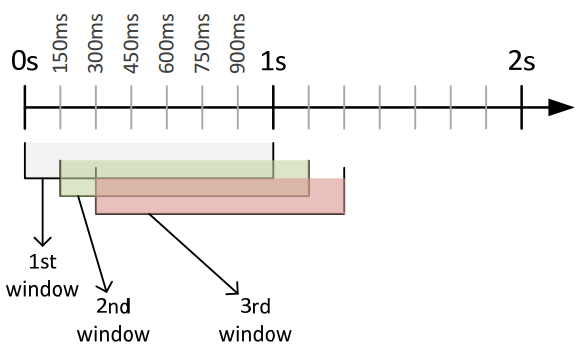

# Overview

The available data is comprised of records containing a range of different types of measurements from motion sensors:

* Roll, pitch & yaw angles.
* Acceleration vector (x, y & z components).
* Acceleration vector magnitude.
* Angular velocity (x, y & z components).
* Earth's magnetic field (x, y & z components).

The motion sensors were placed on four different places in human subjects' bodies and on the dumbbell itself:

* Arm.
* Forearm.
* Waist (Belt).
* Dumbbell.

There is a column for each one of these measurements in the provided data-sets (`*.csv` files). We are going to explore these variables in more detail in the sections that follow.

The objective of this analysis is to classify each record in the testing data-set as belonging to one of the following classes (column `classe`, "exercise class"):

|Class Name|Description     |
|----------|----------------|
|A         |Sitting  (Still)|
|B         |Sitting Down    |
|C         |Standing (Still)|
|D         |Standing Up     |
|E         |Walking         |

The human subjects are six different users identified by the variable `user_name`.

I believe this summarizes everything we need to know about the nature of the information present in the data-sets, but you can find more detailed information [here](http://groupware.les.inf.puc-rio.br/har). 

# Installing the Required Packages

You might need to install the following packages if you don't already have them:

```{r, eval = FALSE}
install.packages("plyr")
install.packages("dplyr")
install.packages("stringr")
install.packages("Amelia")
install.packages("xtable")
install.packages("ggplot2")
install.packages("gridExtra")
install.packages("caret")
install.packages("randomForest")
install.packages("e1071")
install.packages("rpart")
install.packages("tictoc")
install.packages("reshape2")
```

Just uncomment the packages you need and run this chunk before you run the remaining ones in this notebook.

# Importing the Required Packages

Once the libraries are installed, they need to be loaded as follows:

```{r}
suppressMessages(library(plyr, warn.conflicts = FALSE))          # Manipulating dataframes
suppressMessages(library(dplyr, warn.conflicts = FALSE))
suppressMessages(library(stringr))                               # String operations
suppressMessages(library(Amelia))                                # Missing data plots
suppressMessages(library(xtable))                                # Pretty printing dataframes
suppressMessages(library(ggplot2))                               # Plotting
suppressMessages(library(gridExtra))
suppressMessages(library(reshape2))
suppressMessages(library(caret))                                 # Machine learning
suppressMessages(library(randomForest))
suppressMessages(library(e1071))
suppressMessages(library(rpart))
suppressMessages(library(tictoc))                                # Benchmarking
```

# Loading Data

## Reading CSV Files

Let's first load the data-sets:

```{r}
training <- read.csv('../input/pml-training.csv', na.strings=c("NA", "NULL", ""), stringsAsFactors = F)
testing  <- read.csv('../input/pml-testing.csv', na.strings=c("NA", "NULL", ""), stringsAsFactors = F)
```

<br/>
I also want to create a data-set which has all records. There's an odd thing about these data-sets though: The record ID (`X`) starts over from one in the testing data-set, suggesting that the testing and training data-set were not once a whole data-set. I'm going to add the new column `record_id` so we can distinguish training and testing records more easily:

```{r}
training_rows <- nrow(training)
testing_rows <- nrow(testing)
all_rows <- training_rows + testing_rows

training$record_id <- 1:training_rows
testing$record_id <- (training_rows+1):all_rows
all <- rbind.fill(training, testing)
```

## Record Counting

I'm going to introduce a couple of functions before going forward. Data frames show nicely in RStudio, but they look terrible in the HTML output, so I have created a user defined function which renders data frames into HTML tables:

```{r}
render_table_in_viewer_pane <- function(data, digits) {
  html <- print(xtable(data, digits = digits), type = "html", print.results=FALSE)
  temp <- tempfile(fileext = ".html")
  cat(html, file = temp)
  rstudioapi::viewer(temp)
}

render_table <- function(data, digits = 2) {
  render_table_in_viewer_pane(data, digits)
  print(xtable(data, digits = digits), type = "html")
}
```

I have also created a function for creating a summary of record count:

```{r}
data_count <- function(training, testing) {
  result <-               data.frame(measurement = "training records", count = nrow(training))
  result <- rbind(result, data.frame(measurement = "testing records",  count = nrow(testing)))
  result <- rbind(result, data.frame(measurement = "total records",    count = nrow(training) + nrow(testing)))
  result <- rbind(result, data.frame(measurement = "variables",        count = length(names(training))))
  return(result)
}
```

Now we can pretty print the summary using this function:

```{r, results="asis"}
render_table(data_count(training, testing))
```

<br/>
`render_table()` will also render the HTML table in RStudio's "Viewer"" (panel that should be visible on your right). You should be able to see it after executing this chunk.

# Missing Data

## Detecting Missing Data

It's always a good idea to know about missing values from the start. I have created a function for this purpose. Another option would be using functions present in the "Amelia" package, but due to the large number of missing values (`NA`s) in this data, the miss maps just don't look good.

```{r, results="asis"}
missing_summary <- function(data) {
  count <- data %>% summarise_each(funs(sum(is.na(.))))
  output <- data.frame(variable = names(count), missing_count = t(count))
  rownames(output) <- 1:nrow(output)
  output <- output[output$missing_count > 0, ]
  return(output)
}

missing <- missing_summary(all[, !names(all) %in% c("classe") ])
render_table(missing)
```

<br/>
We want to do [imputation](https://en.wikipedia.org/wiki/Imputation_(statistics)) whenever is possible, but given the huge number of missing values for a number of columns in the data-sets (19216 out of 19622 are `NA`s in the training data-set) the only thing we can do is remove these columns:

```{r}
remove_columns <- function(data, columns) {
  data <- data[, ! names(data) %in% columns]
  return(data)
}

extract_data_by_record_id <- function(data_from, ids_from) return(data_from[data_from$record_id %in% ids_from$record_id, ])

all <- remove_columns(all, missing$variable)
training <- extract_data_by_record_id(all, training)
testing <- extract_data_by_record_id(all, testing)
```

Now we can take a sample from the data and see how it looks like:

```{r, results="asis"}
sample_data_frame <- function(data, size) {
  sample_index <- sample(1:nrow(data), size)
  return(data[sample_index, ])
}

sample <- sample_data_frame(training, 10)
render_table(sample)
```

<br/>
Looking much better now. Let's check for missing values once again:

```{r, results="asis"}
render_table(missing_summary(training))
```

<br/>
No missing values to be found. Looking good.

We should do the same checking for the testing data-set as well:

```{r, results="asis"}
render_table(missing_summary(testing))
```

<br/>
Only `classe` is missing, which is ok since the testing data-set isn't labeled.

## Variables & Data Types

`read.csv()` will assign types to variables automatically. You can always check your data types evoking `str()`:

```{r}
str(training)
```

<br/>
Note that most variables are numeric (either integers or floats). The exceptions being `user_name`, `cvtd_timestamp`, `new_window` and `classe` (all strings).

`str()`'s output is a bit hard to read, so I'm going to group the variable names together according with where the motion sensor is placed:

```{r, results="asis"}
matching_variables <- function(data, pattern) {
  return(names(data)[grep(pattern, names(data))])
}

variable_summary <- function(data, patterns) {
  result <- data.frame(pattern = character(0), variables = character(0))
  for(pattern in patterns) {
    result <- rbind(result, data.frame(pattern = pattern, variables = paste(matching_variables(training, paste0(".*", pattern, ".*")), collapse=", ")))
  }
  return(result)
}

render_table(variable_summary(training, c("belt", "[^fore]+arm", "forearm", "dumbbell")))
```

<br/>
The function `variable_summary()` simply looks up and groups together variables which names match the giving input pattern.

We will notice that these variables names are consistent with the experiment setup we have described in the overview section. To be completely honest, I did this variable exploration first and then added more information to the overview section later. I also relied on information from the [study that provided the data](../documents/2012.Ugulino.WearableComputing.HAR.Classifier.RIBBON.pdf) and from [this document on motion sensors](../documents/Sensor-Introduction.pdf), but I believe that you should rely more heavily on the data exploration.

A description for the remaining variables in the data-set follows:

|Measurement         |Comment                                                                                                                      |
|--------------------|-----------------------------------------------------------------------------------------------------------------------------|
|X                   |Record ID.                                                                                                                   |
|user_name           |Username of human subject being measured.                                                                                    |
|raw_timestamp_part_1|First part of the timestamp (which is broken into two variables (due to integer size restrictions in the apparatus it seems).|
|raw_timestamp_part_2|Second part of the timestamp.                                                                                                |
|cvtd_timestamp      |Timestamp formatted as a string: "%d/%m/%y %h:%m".                                                                           |
|new_window          |Is the window a new window: "yes" or "no".                                                                                   |
|num_window          |Window ID.                                                                                                                   |
|classe              |"exercise class" with values A, B, C, D & E, as described in the overview section.                                           |

All measurements are performed inside a one second time window:



Note that there is window overlap. In some of the scatter plots you will find multiple horizontal parallel lines, which are explained by the multiple parallel variable measurements in each given timestamp.

I was a bit insecure about what the variable `new_window` represents, so decided to investigate further and created a function to extract records for a given `num_window` sorted by the timestamp: 


```{r, results="asis"}
extract_window <- function(data, num_window) {
  output <- data[data$num_window == num_window, ]
  output <- output[order(output$raw_timestamp_part_1, output$raw_timestamp_part_2), ]
  return(output[, names(output) %in% c("raw_timestamp_part_1", "raw_timestamp_part_2", "new_window", "num_window")])
}
  
render_table(extract_window(training, num_window = 12))
```

<br/>
If you extract windows for different `num_window` values, you will find this very same pattern over and over. `new_window` seems to indicate that the measurement is the last within a given window and that `num_window` should be incremented for the next measurement.

# Feature Engineering

## Combining `raw_timestamp_part_1`  and `raw_timestamp_par_2`

I'm going to create some additional columns, which will make data a bit easier to work with. For starters, there's no need to keep the timestamp separated into two different columns (that's a limitation from the motion sensor apparatus):

```{r}
add_timestamp <- function(data) {
  data$raw_timestamp <- data$raw_timestamp_part_1 + data$raw_timestamp_part_2
  return(data)
}

all <- add_timestamp(all)
training <- extract_data_by_record_id(all, training)
testing <- extract_data_by_record_id(all, testing)
```

> **NOTE:**
> When imputating missing values or creating new features, I suggest always applying such transformations over the whole data (training + testing) when working with categorical variables. Let's say that you have a factor named `Pie` with levels `Apple`, `Pecan`, `Cherry` and `Pumpkim`. Could be the case that your training data-set has only entries with levels `Apple` and `Pecan` and that your testing data-set `Cherry` and `Pumpkim`. On factor conversion, `Pie` from training will have different levels from `Pie` from testing (incompatible). This will be a pain when you're ready to train your classifier. Of course, you can always override variable factor levels for both data-sets afterwards, but it's a somehow ackward operation.

## Making `classe` More Descriptive

 "A", "B", "C", etc, are not very descriptive, so I'm going to add a column named `classe_description`:

```{r}
add_classe_description <- function(data) {
  descriptions <-                    data.frame(classe = "A", classe_description = "Sitting  (Still)")
  descriptions <-rbind(descriptions, data.frame(classe = "B", classe_description = "Sitting Down"))
  descriptions <-rbind(descriptions, data.frame(classe = "C", classe_description = "Standing (Still)"))
  descriptions <-rbind(descriptions, data.frame(classe = "D", classe_description = "Standing Up"))
  descriptions <-rbind(descriptions, data.frame(classe = "E", classe_description = "Walking"))
  descriptions$classe <- as.factor(descriptions$classe)
  data$classe <- as.factor(data$classe)
  return(left_join(data, descriptions, by = c("classe")))
}

all <- add_classe_description(all)
training <- extract_data_by_record_id(all, training)
testing <- extract_data_by_record_id(all, testing)
```

## Looking Up Patterns

Before we start choosing features for all models, let's begin with graphical exploration. In the next sections we will develop some tools for this purpose.

### Plotting Tools

These are some custom plotting functions I use in my notebooks. I find useful to extract plotting code to functions for re-usability sake:

```{r}
custom_density_plot <- function(data, x_column, color_column) {
  ggplot(data, aes_string(x = x_column, color = color_column)) + 
  geom_density(na.rm = TRUE)
}

custom_violin_plot <- function(data, x_column, color_column) {
  ggplot(data, aes_string(color_column, x_column)) + 
  geom_violin(aes_string(fill = color_column)) + 
  geom_point(position = position_jitter(width = 0.2), color = "blue", alpha = 0.2)
}

custom_scatter_plot <- function(data, x_column, y_column, color_column) {
  ggplot(data, aes_string(x = x_column, y = y_column, color = color_column)) + 
  geom_point()
}

custom_count_barchart <- function(data, column, title) {
   ggplot(data, aes_string(x=column)) + 
   geom_bar(fill = "blue", alpha = 0.2) +
   geom_text(stat='count', aes(label=sprintf("%d%% (%d)", round(..count.. * 100/sum(..count..), 0), ..count..), vjust=0)) +
   xlab(paste(column, "(", title, ")"))
}

correlation_matrix <- function(data) {
  numeric_data <- data[, sapply(data,is.numeric)]
  matrix <- round(cor(numeric_data), 2)
  matrix[upper.tri(matrix)] <- NA
  matrix <- melt(matrix, na.rm = TRUE)
  return(matrix)
}

custom_correlation_heat_map <- function(data) {
  matrix <- correlation_matrix(data)
  ggplot(data = matrix, aes(x = Var1, y = Var2, fill = value)) + 
  geom_tile() +
  scale_fill_gradient2(low = "blue", high = "red", mid = "white", midpoint = 0, limit = c(-1, 1), name="Pearson Correlation") +
  theme(axis.text.x = element_text(angle = 90)) +
  coord_fixed()
}
```

Their names should be descriptive enough for you to deduce what they do. Let's take a look at the scatter plots first.

### Graphical Exploration

I believe that makes more sense to break the data per subject (`user_name`) and not mix data from different human subjects:

```{r, fig.width = 12, fig.height = 6}
jeremy_training <- training[training$user_name == "jeremy", ]
charles_training <- training[training$user_name == "charles", ]

jeremy_scatter <-  custom_scatter_plot(training[training$user_name == "jeremy", ], "raw_timestamp", "total_accel_belt", "classe_description")
charles_scatter <- custom_scatter_plot(training[training$user_name == "charles", ], "raw_timestamp", "total_accel_belt", "classe_description")
grid.arrange(jeremy_scatter, charles_scatter, ncol = 2)
```

I had a somehow naive expectation that I would be able to see some reminiscence of a continuous curve (given that these are time series, `raw_timestamp` is in the x axis), but the sensors don't seem that refined and seem to provide essentially discrete measurements.

From the scatter plots alone, you have the impression that `total_accel_belt` would not be a great predictor given that its values seem to almost fully overlap for all categories of `classe` (we can't see patches of different colors, each one representing a different `classe`). 

You will see that this is not the case though, the variable is a fairly good predictor (not as good as the remaining ones though). Scatter plots are not the best tool for finding patterns in this particular data though. Despite of that, I'm going to plot another variable (`total_accel_forearm`, which seems to present the least amount of overlap) just to show a better case:

```{r, fig.width = 12, fig.height = 6}
jeremy_scatter <-  custom_scatter_plot(jeremy_training, "raw_timestamp", "total_accel_forearm", "classe_description")
charles_scatter <- custom_scatter_plot(charles_training, "raw_timestamp", "total_accel_forearm", "classe_description")

grid.arrange(jeremy_scatter, charles_scatter, ncol = 2)
```

Given that these measurements are not as smooth as I was expecting and we can easily identify any patterns, density plots might be more suitable for the job. I'm also going to adopt "jeremy" as the user for plot analysis from this point on:

```{r, fig.width = 24, fig.height = 12}
density_total_accel_forearm <- custom_density_plot(jeremy_training, "total_accel_forearm", "classe_description")
violin_total_accel_forearm <- custom_violin_plot(jeremy_training, "total_accel_forearm", "classe_description")

grid.arrange(density_total_accel_forearm, violin_total_accel_forearm, ncol = 2)
```

<br/>
You should be familiar with [density plots](http://www.datavizcatalogue.com/methods/density_plot.html), but a good alternative are [violin plots](https://en.wikipedia.org/wiki/Violin_plot), which can be seem as "augmented [box plots](https://en.wikipedia.org/wiki/Box_plot)". As in box plots, the region outside the violin box represents the [outliers](https://en.wikipedia.org/wiki/Outlier), while frequent values are kept inside. In violin box plots the width changes according with how frequent (or dense) a value is in the scale, while in box plots the box's width is constant though (the box is square).

I feel like violin plots are better visual tools than density ones, so I'm going to use them from now on:

```{r, fig.width = 24}
violin_total_accel_arm      <- custom_violin_plot(jeremy_training, "total_accel_arm", "classe_description")
violin_total_accel_belt     <- custom_violin_plot(jeremy_training, "total_accel_belt", "classe_description")
violin_total_accel_dumbbell <- custom_violin_plot(jeremy_training, "total_accel_dumbbell", "classe_description")

grid.arrange(violin_total_accel_forearm, violin_total_accel_arm, violin_total_accel_belt, violin_total_accel_dumbbell, ncol = 2)
```

<br/>
I have only plotted four variables, one variable per violin plot. You might have noticed that the box shapes change quite a bit when we shift from one `classe` to another in a plot.
We are going to take advantage of these differences in data density patterns to predict `classe` for the testing data-set.

### Correlation Between Variables

I'm going to use the correlation heat map we have introduced in the plotting utilities section:

```{r, fig.width = 12, fig.height = 12}
custom_correlation_heat_map(training)
```
<br/>
I must remind you that correlation matrices only work with numeric variables.

Notice that some high correlations are obvious like `total_accel_dumbbell` and `accel_dumbell_x` or `accel_dumbell_y` or `accel_dumbell_z` (its components).

You will also notice that the motion of the dumbbell is highly correlated with the motion of the forearm, which also makes sense.

In general, most measurements seem uncorrelated (the heat map is quite sparse), which is a good thing, means that most variables are not superfluous and therefore, I don't see a reason to do [principal component analysis](https://en.wikipedia.org/wiki/Principal_component_analysis). I don't think we would get much benefit from it.

## Choosing Predictors

Some of the fields just won't make good predictors, like the timestamps (`raw_timestamp_part_1`, `raw_timestamp_part_2`, `cvtd_timestamp`) and  window variables (`num_window` and  `new_window`) given that they obviously don't correlate with `classe` (they are timestamps, indexes and control variables) and therefore we are going to remove them:

```{r}
not_correlated_columns <- c("raw_timestamp_part_1", "raw_timestamp_part_2", "raw_timestamp", "cvtd_timestamp", "num_window", "new_window", "classe_description", "user_name")
training <- remove_columns(training, not_correlated_columns)
testing <- remove_columns(testing, not_correlated_columns)
all <- rbind.fill(training, testing)
```

I'm removing `user_name` as well. We don't want this variable: The plan is to identify motion patterns for any individual, not motion patterns for particular individuals.

`classe_description` was just useful for analysis, so we will drop it as well.

A last step before we begin classification is converting `classe` to factor:

```{r}
all$classe <- as.factor(all$classe)

training <- extract_data_by_record_id(all, training)
testing <- extract_data_by_record_id(all, testing)
```

That's the last transformation required, so we can remove `record_id`:

```{r}
training <- remove_columns(training, c("record_id"))
testing <- remove_columns(testing, c("record_id"))
```

# Classification

In this section I'm going to try a few different classifier on the available data and compare how they perform using accuracy as a metric. You can extract these metrics from the confusion matrix, so I have created the following method for this purpose:


```{r}
accuracy <- function(confusion) return(confusion$overall["Accuracy"])
```

## Model Building

One thing you will noticed with machine learning packages is that they don't quite follow a common interface. For instance, when getting a prediction using the "randomForest" package, `type` should be set to "class", while for the package "party", `type` should be set to "response". I want to avoid copying & pasting programming as much as possible, so I want functions that evaluate models and determine their accuracy that work for multiple packages. For this reason, I have defined a common interface for all models:

|function                    |description                                             |
|----------------------------|--------------------------------------------------------|
|`build(formula, data)`      |Builds a model from a formula and training data.        |
|`predictions(model, data)`  |Generate predictions for the input data using the model.|

R doesn't quite support [OOP](https://en.wikipedia.org/wiki/Object-oriented_programming), but you can emulate some OOP principles like [encapsulation](https://en.wikipedia.org/wiki/Encapsulation_(computer_programming)), so I have encapsulated `build()` and `predictions()` inside an object. I also have included the attribute `name`, so we can easy identify the model.

In short, what you need to do is create a function that follows this template:

```{r}
my_model_builder <- function() {
  
  name <- "<name of my model builder"
  
  build <- function(formula, data) "<my model builder code>"

  predictions <- function(model, data) "<my predictions function>"
  
  error_rate <- function(model) "<my OOB eror function>"

  return(list(name=name, build=build, predictions=predictions))
}
```

In the following chunk, I have created builders for a number of different packages:

```{r}
SEED <- 345

random_forest_builder <- function() {

  name <- "Random Forest (randomForest package)"
  
  build <- function(formula, data) return(randomForest(formula, data = data))
  
  predictions <- function(model, data) return(predict(model, newdata = data, type = "class"))

  return(list(name=name, build=build, predictions=predictions))
}

svm_builder <- function() {
  
  name <- "SVM (e1071 package)"
  
  build <- function(formula, data) return(svm(formula, data = data, probability=TRUE))
  
  predictions <- function(model, data) return(predict(model, newdata = data, type = "class"))
  
  return(list(name=name, build=build, predictions=predictions))
}

decision_tree_builder <- function() {
  
  name <- "Decision Tree (rpart package)"
  
  build <- function(formula, data) return(rpart(formula, data = data, method="class"))

  predictions <- function(model, data) return(predict(model, newdata = data, type = "class"))

  return(list(name=name, build=build, predictions=predictions))
}

random_forest_k_fold_cross_validation_builder <- function() {
  name <- "Random Forest with K-Fold Cross Validation (caret package)"
  
  build <- function(formula, data) {
    control <- trainControl(method = "cv", number = 5)
    return(train(formula, data = data,
                 method = "rf",  trControl = control,
                 metric="Accuracy", importance = TRUE))
  }
  
  predictions <- function(model, data) return(predict(model, newdata = data, type = "raw"))

  return(list(name=name, build=build, predictions=predictions))
}
```

## Model Evaluation

### Evaluation Tools

Now we can implement a general function that can evaluate any model from any package as long as we build a builder object that follows this common interface:

```{r}
wrap_string <- function(string) {
  return(paste(strwrap(string, 50), collapse="\n"))
}

formula_name <- function(formula) {
  name <- paste(format(formula), collapse = "")
  name <- wrap_string(name)
  return(name)
}

empty_evaluation <- function() {
  empty <- data.frame(model             = character(), 
                      formula           = character(), 
                      accuracy          = numeric(0),
                      error_rate        = numeric(0),
                      elapsed_time_secs = numeric(0),
                      stringsAsFactors=FALSE)
  return(empty)
}

evaluate_model <- function(formula, model_builder, prediction_column, train_data, cross_validation_data) {
  tic()
  builder <- model_builder()
  model <- builder$build(formula, train_data)
  predictions <- builder$predictions(model, cross_validation_data)
  confusion <- confusionMatrix(data = predictions, reference = cross_validation_data[, prediction_column])
  garbage <- capture.output(exec_time <- toc())
  evaluation <- data.frame(model             = builder$name, 
                           formula           = formula_name(formula),
                           accuracy          = accuracy(confusion), 
                           error_rate        = 1 - accuracy(confusion),
                           elapsed_time_secs = (exec_time$toc - exec_time$tic),
                           stringsAsFactors=FALSE)
  return(evaluation)
}

evaluate_models <- function(formulas, model_builders, prediction_column, train_data, cross_validation_data) {
  evaluations <- empty_evaluation()

  for (model_builder in model_builders) {
    for (formula in formulas) {
      set.seed(SEED)
      evaluation <- evaluate_model(formula, model_builder, prediction_column, train_data, cross_validation_data)
      evaluations <- bind_rows(evaluations, evaluation)
    }
  }
  render_table(evaluations, digits = 6)
}
```

Armed with this evaluation function I can easily evaluate new models without having to change much code. All I have to do is create a builder object and add it to the list of models passed to `evaluate_models()` and I don't need to modify the evaluation function in any way.

If you are not a programmer, this code design practice is called the [open/closed principle](https://en.wikipedia.org/wiki/Open/closed_principle).

### Evaluating Different Model Types

Let's try to evaluate a couple of models now. We need `X` to identify each record when generating the output, but `X` has no value as a predictor and therefore it has been excluded from the formula:

```{r, results="asis"}
set.seed(SEED)
train_idx  <- createDataPartition(training$classe, p = 0.6, list = FALSE, times = 1)
train_data <- training[train_idx, ]
cross_validation_data  <- training[-train_idx, ]

formulas <- c(classe ~ . - X)
models <- c(random_forest_builder, svm_builder, decision_tree_builder, random_forest_k_fold_cross_validation_builder)
evaluate_models(formulas, models, "classe", train_data, cross_validation_data)
```

<br/>
Notice that I'm breaking the origin training data-set into a new training (`train_data`, let's called "sub-training") and cross validation data-sets. The error rate showed in the output is a good estimate of the out-of-sample error in the testing data-set, given that is calculated over cross validation data, which doesn't share any records with the sub-training data-set.

You might notice that I have a single evaluation function that can evaluate any model for any package (as long a create a model builder object that follows the pre-defined interface).
Also note that I'm breaking the training data into `train_data` and `cross_validation_data`, given that the provided testing data-set isn't labeled.

From the evaluation results, random forest (from the "randomForest" package) performed the best. I have also used random forest with [k-fold cross validation](https://en.wikipedia.org/wiki/Cross-validation_(statistics)), which took almost 20 minutes to complete ("k" equal to 5) and performed worst than the first. I guess it could be improved by increasing k, but it would make the creation of the classifier much slower. It seems like the default values of `ntree` (500) and `mtry` (5) for the "randomForest" trainer do a good enough job.

### Evaluating with Subsets of Features

This experiment makes uses of a range of different sensors (roll, pitch, yaw, acceleration, etc) located in different parts of the human subject's body (arm, forearm, belt & dumbbell).

I was wondering about how much accuracy I could get from these sensors separately (for different body parts or types of measurement). That's an interesting question: Do we really need that many sensors?

The random forest (package randomForest) seems quite fast, so I'm going to repeat the evaluation for different combinations of features.

#### Features Grouped by Body Part

```{r, results="asis"}
belt_formula <- classe~roll_belt+pitch_belt+yaw_belt+total_accel_belt+
                  gyros_belt_x+gyros_belt_y+gyros_belt_z+
                  accel_belt_x+accel_belt_y+accel_belt_z+
                  magnet_belt_x+magnet_belt_y+magnet_belt_z

arm_formula <- classe~roll_arm+pitch_arm+yaw_arm+total_accel_arm+
                 gyros_arm_x+gyros_arm_y+gyros_arm_z+
                 accel_arm_x+accel_arm_y+accel_arm_z+
                 magnet_arm_x+magnet_arm_y+magnet_arm_z

forearm_formula <- classe~roll_forearm+pitch_forearm+yaw_forearm+total_accel_forearm+
                     gyros_forearm_x+gyros_forearm_y+gyros_forearm_z+
                     accel_forearm_x+accel_forearm_y+accel_forearm_z+
                     magnet_forearm_x+magnet_forearm_y+magnet_forearm_z

dumbbell_formula <- classe~roll_dumbbell+pitch_dumbbell+yaw_dumbbell+total_accel_dumbbell+
                      gyros_dumbbell_x+gyros_dumbbell_y+gyros_dumbbell_z+
                      accel_dumbbell_x+accel_dumbbell_y+accel_dumbbell_z+
                      magnet_dumbbell_x+magnet_dumbbell_y+magnet_dumbbell_z
```

```{r, results="asis"}
formulas <- c(belt_formula, arm_formula, forearm_formula, dumbbell_formula)
models <- c(random_forest_builder)
evaluate_models(formulas, models, "classe", train_data, cross_validation_data)
```

<br/>

#### Features Grouped by Type of Measurement

```{r, results="asis"}
roll_pitch_yaw_formula <- classe~roll_belt+pitch_belt+yaw_belt+
                            roll_arm+pitch_arm+yaw_arm+
                            roll_forearm+pitch_forearm+yaw_forearm+
                            roll_dumbbell+pitch_dumbbell+yaw_dumbbell

total_accel_formula <- classe~total_accel_belt+total_accel_arm+total_accel_forearm+total_accel_dumbbell

gyros_formula <- classe~gyros_belt_x+gyros_belt_y+gyros_belt_z+
                   gyros_arm_x+gyros_arm_y+gyros_arm_z+
                   gyros_forearm_x+gyros_forearm_y+gyros_forearm_z+
                   gyros_dumbbell_x+gyros_dumbbell_y+gyros_dumbbell_z
                 
magnet_formula <- classe~magnet_belt_x+magnet_belt_y+magnet_belt_z+
                    magnet_arm_x+magnet_arm_y+magnet_arm_z+
                    magnet_forearm_x+magnet_forearm_y+magnet_forearm_z+
                    magnet_dumbbell_x+magnet_dumbbell_y+magnet_dumbbell_z 

accel_formula <- classe~accel_belt_x+accel_belt_y+accel_belt_z+
                   accel_arm_x+accel_arm_y+accel_arm_z+
                   accel_forearm_x+accel_forearm_y+accel_forearm_z+
                   accel_dumbbell_x+accel_dumbbell_y+accel_dumbbell_z
```

```{r, results="asis"}
formulas <- c(roll_pitch_yaw_formula, total_accel_formula, gyros_formula, magnet_formula, accel_formula)
evaluate_models(formulas, models, "classe", train_data, cross_validation_data)
```

#### Combining Features from Different Groups

```{r, results="asis"}
belt_forearm_formula <- classe~roll_belt+pitch_belt+yaw_belt+total_accel_belt+
                          gyros_belt_x+gyros_belt_y+gyros_belt_z+
                          accel_belt_x+accel_belt_y+accel_belt_z+
                          magnet_belt_x+magnet_belt_y+magnet_belt_z+
                          roll_forearm+pitch_forearm+yaw_forearm+total_accel_forearm+
                          gyros_forearm_x+gyros_forearm_y+gyros_forearm_z+
                          accel_forearm_x+accel_forearm_y+accel_forearm_z+
                          magnet_forearm_x+magnet_forearm_y+magnet_forearm_z

roll_pitch_yaw_magnet_formula <- classe~roll_belt+pitch_belt+yaw_belt+
                                   roll_arm+pitch_arm+yaw_arm+
                                   roll_forearm+pitch_forearm+yaw_forearm+
                                   roll_dumbbell+pitch_dumbbell+yaw_dumbbell+
                                   magnet_belt_x+magnet_belt_y+magnet_belt_z+
                                   magnet_arm_x+magnet_arm_y+magnet_arm_z+
                                   magnet_forearm_x+magnet_forearm_y+magnet_forearm_z+
                                   magnet_dumbbell_x+magnet_dumbbell_y+magnet_dumbbell_z
```

```{r, results="asis"}
formulas <- c(belt_forearm_formula, roll_pitch_yaw_magnet_formula)
evaluate_models(formulas, models, "classe", train_data, cross_validation_data)
```

<br/>

#### Evaluation Aftermath

Not surprisingly, `total_accel_formula` didn't fare well, given that taking the vector magnitude removes spacial information from acceleration, thus `accel_formula` did much better. 

`roll_pitch_yaw_magnet_formula` (combining roll, pitch, yawn and magnetic measurements) seems to do almost as good in predicting `classe` as the full formula, with an accuracy of nearly 0.99. 

`belt_forearm_formula` (combining belt and forearm measurements) also has accuracy close to 0.99.

If we were to put an actual bio-metric fitness product in the market (and I guess that was one of the motivations of the research), I believe that we would try to simplify our design as much as possible.

There's also the matter of convenience: I'm guessing that most people are probably not willing to wear this many sensors.

### Feature Importance

```{r, fig.width = 12, fig.height = 12}
builder <- random_forest_builder()
model <- builder$build(classe ~ . - X, training)
varImpPlot(model, type=2)
```


<br/>
You may have noticed that the best predictors are roll, pitch, yaw and magnetic measurements, as we have pointed out in the previous section when evaluating models with different combinations of features.

## Predictions

Let's generate an output file with our predictions now:

```{r, results="asis"}
remove_non_alphanumeric <- function(string) {
  return(str_replace_all(string, "[^\\w]", ""))
}

output_name <- function(formula, builder_name) {
  output <- paste0(builder_name, formula_name(formula))
  output <- remove_non_alphanumeric(output)
  output <- paste0(output, ".csv")
  return(output)
}

generate_predictions <- function(formula, model_builder, prediction_column, index_column, train_data, input_data) {
  builder <- model_builder()
  model <- builder$build(formula, train_data)
  predictions <- builder$predictions(model, input_data)
  input_data[, prediction_column] <- predictions
  output <- input_data[, names(input_data) %in% c(index_column, prediction_column)]
  write.csv(output, file = output_name(formula, builder$name), row.names = FALSE)
  return(input_data)
}

output <- generate_predictions(classe ~ . - X, random_forest_builder, "classe", "X", training, testing)
```

Let's compare the counts for the training and testing data-set as a sanity check:

```{r, fig.width = 12}
training_count <- custom_count_barchart(training, "classe", "training")
testing_count <- custom_count_barchart(output, "classe", "testing")

grid.arrange(training_count, testing_count, ncol = 2)
```

<br/>
I was expecting similar counts (percentages), but it's not necessarily the case that the training and testing data-sets where randomly split from a single whole data-set. If you recall, `X` (record ID) for the testing data-set overlaps with the ones for the training data-set suggesting that they were generated by independent experiments with the same setup.

# Final Words

An interesting thing to notice about our data is the amount of measurements taken (accelerations, angular velocities, etc). One would think that tracking a single variable over time (position for instance) would be enough to deduce `classe`.

Also, looking at the scatter plots you will notice that the data is not that smooth and is quite noisy.

In practice measurement apparatus are never perfect and the best ones might be quite expensive. You get more bang for your buck by using many low quality inexpensive apparatus than few high quality expensive ones. Even though the quality of our measurements is not that great, we can compensate by taking more measurements (from different sources) and still do very well in the classification.
